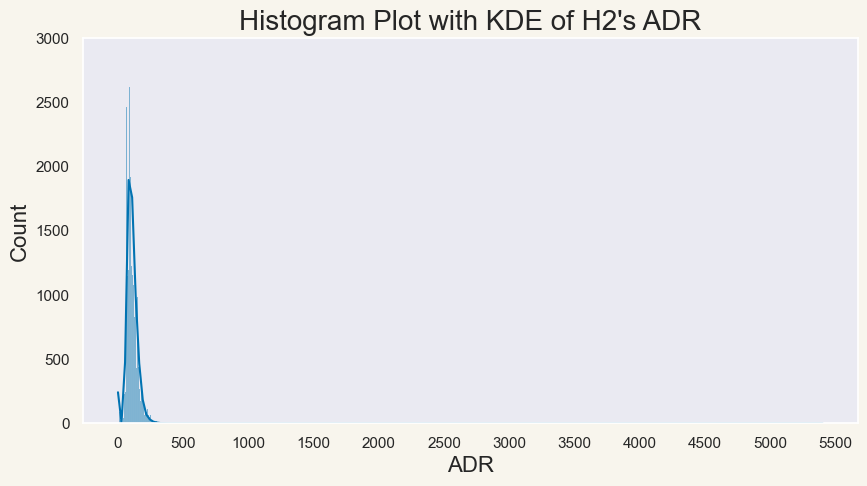

- [Introduction](#org493739b)
- [Imports and Environment Variables](#org42bd5e8)
- [Exploratory Data Analysis](#orgc322a6c)
  - [Metadata](#org5e54d65)
  - [Descriptive Statistics](#orgbe6bdb1)
  - [Further Exploration of Numeric Features](#org59eb980)
    - [Average Daily Rate (ADR)](#org4b52d86)
    - [Adults](#org7cdc041)
    - [PreviousCancellations](#org802debd)
    - [PreviousBookingsNotCanceled](#org39c4c2c)
    - [ArrivalDateWeekNumber](#org0e35cf7)
  - [Value Counts of Categorical Features](#orgd692da9)
  - [Further Exploration of the Categorical Features](#orgfc6c7ed)
    - [CustomerType and Adults](#org1a689c4)
    - [PreviousBookingsNotCanceled Relationship with Categoricals](#org0cebd8d)
    - [ArrivalDateMonth](#org6101255)
    - [Country](#org1cfa93c)
    - [ReservedRoomType and AssignedRoomType](#orgeeefe18)
  - [Missing Values](#orgd12b735)
  - [Feature Correlations](#org71ffa14)
    - [H1 Correlation Heatmap](#orgd37495a)
    - [H2 Correlation Heatmap](#org65b72ab)
    - [Notes on the Correlations](#org1eb3b84)
- [Data Cleaning](#org42dfd18)
  - [Removing Noise Found in the EDA](#org5b37546)
  - [Combining H1 and H2](#orgd5a8e4a)
  - [Converting to Correct Data Types](#org5541303)
- [Data Transformation and Feature Engineering](#org4620103)
  - [Date Granularity](#org0a74173)
    - [ArrivalDate](#orga0ef606)
    - [Expanding Data from an ArrivalDate Basis to a Day of Stay Basis](#org9ab4c69)
  - [Seasonality](#orge93c8f7)
    - [Holidays](#org2433f30)
    - [Constructing the Day of the Week Feature](#org8a5673c)
    - [Adding DayOfMonth, WeekNumber and Month for StayDate](#org3e7cb50)
    - [DayOfWeek, Month, WeekNumber and ADR](#orgc140f9c)
  - [Making Cyclical Features Actually Cyclical](#org2862a43)
  - [LeadTime and ADR](#org8b20c51)
  - [ReservedRoomType and ADR](#org7fba20d)
  - [Final Data Conversion](#org3372df7)
- [Constructing a Target Variable](#org3554d64)
    - [Prediction Error of Mean Predictor](#org39b741c)
    - [Prediction Error of Manually Weighted PF on Base Rate](#org57ee4e6)
    - [PriceFactor Formula Optimization](#org718f493)
    - [LightGBM Regressor as PriceFactor](#orgf9430d5)
- [Conclusion](#orgca50aac)


<a id="org493739b"></a>

# Introduction

The Mews Data Scientist assessment revolves around a hotel booking demand dataset described [in a scientific paper published on sciencedirect](https://www.sciencedirect.com/science/article/pii/S2352340918315191), which I've also provided physically [here](references/1-s2.0-S2352340918315191-main.pdf).

The task of the assessment is to develop a predictive model which determines the hotel pricing based on demand. Mews has provided a set of instructions for this task:

-   Understand the problem - read the literature.
-   Complete an exploratory data analysis (EDA), including an investigation of correlation.
-   Develop a model for predicting hotel pricing based on demand, using the provided data.
-   Assess the model performance using appropriate metrics.
-   Provide a comprehensive report (documentation) of the process and findings.


<a id="org42bd5e8"></a>

# Imports and Environment Variables

```python
from __future__ import annotations

import datetime
import json
import pprint
from typing import Optional

import holidays
import matplotlib.pyplot as plt
import numpy as np
import pandas as pd
import seaborn as sns
import shap
from lightgbm import (
    LGBMRegressor,
    early_stopping,
    log_evaluation,
    plot_importance,
    record_evaluation,
)
from matplotlib.cm import coolwarm
from matplotlib.colors import Normalize
from scipy.optimize import minimize
from sklearn.metrics import mean_absolute_error as mae
from sklearn.metrics import mean_squared_error as mse
from sklearn.metrics import r2_score
from sklearn.metrics import root_mean_squared_error as rmse
from sklearn.model_selection import train_test_split
from tqdm import tqdm
```

A few Pandas settings to make exploring the data neater.

```python
pd.set_option("display.max_columns", 50)
pd.set_option("display.max_rows", 100)
pd.set_option("display.width", 1000)
tqdm.pandas()
```

Colourpalette for Seaborn to include everyone.

```python
CB_color_cycle: list[str] = [
    "#FFFFF2",
    "#E69F00",
    "#56B4E9",
    "#009E73",
    "#F0E442",
    "#0072B2",
    "#D55E00",
    "#CC79A7",
    "#8C564B",
    "#C7C7C7",
    "#DBDB8D",
    "#4053D3",
]
sns.set_theme(style="darkgrid", palette="colorblind")
```

A random seed for experiments

```python
seed: int = 542
```


<a id="orgc322a6c"></a>

# Exploratory Data Analysis

The hotel booking demand dataset contains data from a resort hotel, `H1`, located in the Algarve, and a city hotel, `H2`, located in Lisbon. Although the data is split in two files respectively, the data contains the same structure and represents bookings due to arrive between <span class="timestamp-wrapper"><span class="timestamp">&lt;2015-07-01 Wed&gt; </span></span> and <span class="timestamp-wrapper"><span class="timestamp">&lt;2017-08-31 Thu&gt;</span></span>.

The data contains **31 features** and is **a mix of raw and preprocessed data**. Each data point time is **defined as the day prior to the arrival date**.

The scientific paper already provides some *descriptive statistics*, but let's do our own analysis as well, as part of the EDA.

Furthermore, each feature/variable is also described extensively in the paper, including their datatypes and meaning.

Let's now load the data into Pandas DataFrames.

```python
H1: pd.DataFrame = pd.read_csv("data/H1.csv")
H2: pd.DataFrame = pd.read_csv("data/H2.csv")
print(f"Shape of H1: {H1.shape}\nShape of H2: {H2.shape}")
```

    Shape of H1: (40060, 31)
    Shape of H2: (79330, 31)

There is indeed 31 features in both `H1` and `H2`.

As we're exploring the data and its distributions, we'll likely encounter some anomalies or noise, which we may want to filter out, so let's create some sets that can hold indices we want to drop before modelling.

```python
H1_noise: set[int] = set()
H2_noise: set[int] = set()
```


<a id="org5e54d65"></a>

## Metadata

We'll first have a look at the metadata of the datasets.

```python
H1.info()
```

```
<class 'pandas.core.frame.DataFrame'>
RangeIndex: 40060 entries, 0 to 40059
Data columns (total 31 columns):
 #   Column                       Non-Null Count  Dtype  
---  ------                       --------------  -----  
 0   IsCanceled                   40060 non-null  int64  
 1   LeadTime                     40060 non-null  int64  
 2   ArrivalDateYear              40060 non-null  int64  
 3   ArrivalDateMonth             40060 non-null  object 
 4   ArrivalDateWeekNumber        40060 non-null  int64  
 5   ArrivalDateDayOfMonth        40060 non-null  int64  
 6   StaysInWeekendNights         40060 non-null  int64  
 7   StaysInWeekNights            40060 non-null  int64  
 8   Adults                       40060 non-null  int64  
 9   Children                     40060 non-null  int64  
 10  Babies                       40060 non-null  int64  
 11  Meal                         40060 non-null  object 
 12  Country                      39596 non-null  object 
 13  MarketSegment                40060 non-null  object 
 14  DistributionChannel          40060 non-null  object 
 15  IsRepeatedGuest              40060 non-null  int64  
 16  PreviousCancellations        40060 non-null  int64  
 17  PreviousBookingsNotCanceled  40060 non-null  int64  
 18  ReservedRoomType             40060 non-null  object 
 19  AssignedRoomType             40060 non-null  object 
 20  BookingChanges               40060 non-null  int64  
 21  DepositType                  40060 non-null  object 
 22  Agent                        40060 non-null  object 
 23  Company                      40060 non-null  object 
 24  DaysInWaitingList            40060 non-null  int64  
 25  CustomerType                 40060 non-null  object 
 26  ADR                          40060 non-null  float64
 27  RequiredCarParkingSpaces     40060 non-null  int64  
 28  TotalOfSpecialRequests       40060 non-null  int64  
 29  ReservationStatus            40060 non-null  object 
 30  ReservationStatusDate        40060 non-null  object 
dtypes: float64(1), int64(17), object(13)
memory usage: 9.5+ MB
```

```python
H2.info()
```

```
<class 'pandas.core.frame.DataFrame'>
RangeIndex: 79330 entries, 0 to 79329
Data columns (total 31 columns):
 #   Column                       Non-Null Count  Dtype  
---  ------                       --------------  -----  
 0   IsCanceled                   79330 non-null  int64  
 1   LeadTime                     79330 non-null  int64  
 2   ArrivalDateYear              79330 non-null  int64  
 3   ArrivalDateMonth             79330 non-null  object 
 4   ArrivalDateWeekNumber        79330 non-null  int64  
 5   ArrivalDateDayOfMonth        79330 non-null  int64  
 6   StaysInWeekendNights         79330 non-null  int64  
 7   StaysInWeekNights            79330 non-null  int64  
 8   Adults                       79330 non-null  int64  
 9   Children                     79326 non-null  float64
 10  Babies                       79330 non-null  int64  
 11  Meal                         79330 non-null  object 
 12  Country                      79306 non-null  object 
 13  MarketSegment                79330 non-null  object 
 14  DistributionChannel          79330 non-null  object 
 15  IsRepeatedGuest              79330 non-null  int64  
 16  PreviousCancellations        79330 non-null  int64  
 17  PreviousBookingsNotCanceled  79330 non-null  int64  
 18  ReservedRoomType             79330 non-null  object 
 19  AssignedRoomType             79330 non-null  object 
 20  BookingChanges               79330 non-null  int64  
 21  DepositType                  79330 non-null  object 
 22  Agent                        79330 non-null  object 
 23  Company                      79330 non-null  object 
 24  DaysInWaitingList            79330 non-null  int64  
 25  CustomerType                 79330 non-null  object 
 26  ADR                          79330 non-null  float64
 27  RequiredCarParkingSpaces     79330 non-null  int64  
 28  TotalOfSpecialRequests       79330 non-null  int64  
 29  ReservationStatus            79330 non-null  object 
 30  ReservationStatusDate        79330 non-null  object 
dtypes: float64(2), int64(16), object(13)
memory usage: 18.8+ MB
```

Aside from the lengths of the data, the only apparent difference is that the `Children` feature contains empty values in `H2` while it doesn't in `H1`.


<a id="orgbe6bdb1"></a>

## Descriptive Statistics

Let's have a look at the descriptive statistics of the DataFrames.

```python
H1.describe().T
```

```
                               count         mean        std      min     25%     50%     75%     max
IsCanceled                   40060.0     0.277634   0.447837     0.00     0.0     0.0     1.0     1.0
LeadTime                     40060.0    92.675686  97.285315     0.00    10.0    57.0   155.0   737.0
ArrivalDateYear              40060.0  2016.121443   0.722347  2015.00  2016.0  2016.0  2017.0  2017.0
ArrivalDateWeekNumber        40060.0    27.140864  14.005441     1.00    16.0    28.0    38.0    53.0
ArrivalDateDayOfMonth        40060.0    15.821243   8.883708     1.00     8.0    16.0    24.0    31.0
StaysInWeekendNights         40060.0     1.189815   1.147812     0.00     0.0     1.0     2.0    19.0
StaysInWeekNights            40060.0     3.128732   2.461329     0.00     1.0     3.0     5.0    50.0
Adults                       40060.0     1.867149   0.697285     0.00     2.0     2.0     2.0    55.0
Children                     40060.0     0.128682   0.445195     0.00     0.0     0.0     0.0    10.0
Babies                       40060.0     0.013904   0.118998     0.00     0.0     0.0     0.0     2.0
IsRepeatedGuest              40060.0     0.044383   0.205948     0.00     0.0     0.0     0.0     1.0
PreviousCancellations        40060.0     0.101722   1.335115     0.00     0.0     0.0     0.0    26.0
PreviousBookingsNotCanceled  40060.0     0.146455   1.001955     0.00     0.0     0.0     0.0    30.0
BookingChanges               40060.0     0.287968   0.726548     0.00     0.0     0.0     0.0    17.0
DaysInWaitingList            40060.0     0.527758   7.428580     0.00     0.0     0.0     0.0   185.0
ADR                          40060.0    94.952930  61.442418    -6.38    50.0    75.0   125.0   508.0
RequiredCarParkingSpaces     40060.0     0.138068   0.351001     0.00     0.0     0.0     0.0     8.0
TotalOfSpecialRequests       40060.0     0.619770   0.813930     0.00     0.0     0.0     1.0     5.0
```

```python
H2.describe().T
```

```
                               count         mean         std     min     25%     50%     75%     max
IsCanceled                   79330.0     0.417270    0.493111     0.0     0.0     0.0     1.0     1.0
LeadTime                     79330.0   109.735724  110.948526     0.0    23.0    74.0   163.0   629.0
ArrivalDateYear              79330.0  2016.174285    0.699181  2015.0  2016.0  2016.0  2017.0  2017.0
ArrivalDateWeekNumber        79330.0    27.177449   13.398523     1.0    17.0    27.0    38.0    53.0
ArrivalDateDayOfMonth        79330.0    15.786625    8.728451     1.0     8.0    16.0    23.0    31.0
StaysInWeekendNights         79330.0     0.795185    0.885026     0.0     0.0     1.0     2.0    16.0
StaysInWeekNights            79330.0     2.182957    1.456416     0.0     1.0     2.0     3.0    41.0
Adults                       79330.0     1.850977    0.509292     0.0     2.0     2.0     2.0     4.0
Children                     79326.0     0.091370    0.372177     0.0     0.0     0.0     0.0     3.0
Babies                       79330.0     0.004941    0.084323     0.0     0.0     0.0     0.0    10.0
IsRepeatedGuest              79330.0     0.025615    0.157983     0.0     0.0     0.0     0.0     1.0
PreviousCancellations        79330.0     0.079743    0.415472     0.0     0.0     0.0     0.0    21.0
PreviousBookingsNotCanceled  79330.0     0.132371    1.693411     0.0     0.0     0.0     0.0    72.0
BookingChanges               79330.0     0.187369    0.608620     0.0     0.0     0.0     0.0    21.0
DaysInWaitingList            79330.0     3.226774   20.870890     0.0     0.0     0.0     0.0   391.0
ADR                          79330.0   105.304465   43.602954     0.0    79.2    99.9   126.0  5400.0
RequiredCarParkingSpaces     79330.0     0.024367    0.154919     0.0     0.0     0.0     0.0     3.0
TotalOfSpecialRequests       79330.0     0.546918    0.780776     0.0     0.0     0.0     1.0     5.0
```

A few things stand out when looking at the datasets.

-   **IsCanceled:** `H2` has a much higher cancellation rate, about **41.7%**, compared to the **27.7%** in `H1`.
-   **LeadTime:** In `H2` the lead time is on average **17** days longer than in `H1`.
-   **StaysInWeekendNights / StaysInWeekNights:** Guests tend to have shorter stays at `H2` compared to `H1`, in both weekdays and weekends.
-   **Children / Babies:** `H2` has a slightly fewer number of `Children` and `Babies` on bookings on average. This may mean `H2` caters more to business trips (as supported by the shorter stays) or to couples/adults travelling without children.
-   **IsRepeatedGuest:** `H1` has about a **2%** higher rate of repeat customers than `H2`. This could mean a number of things, for example that the hotel has been operating longer, that guests are more satisfied or that the hotel is better at handling guest retention.
-   **BookingChanges:** It seems that `H1` has a higher rate of booking changes, about **0.10** higher than `H2`. This could mean `H1` is more flexible or that there is more need for changes.
-   **DaysInWaitingList:** `H2` has a signficantly higher waiting list time at about **3.22 days** compared to the about **0.52 days** in `H1`. This could either mean there is a higher demand or less immediate availability in `H2`.
-   **ADR:** The Average Daily Rate is about **10** higher in `H2`. This makes sense since it's a resort hotel and `H1` is a city hotel.

Furthermore, a few possible anomalies stand out:

-   The **max** ADR at `H2` is **5400**, which could be an expensive suite on the resort, but we'll need to verify this.
-   The **min** ADR at `H1` is a negative number and in `H2` is **0.0**, we'll need to investigate if this makes sense.
-   The **max** number of **adults** on a booking at `H1` is **55**, this seems high, so let's have a look at that too. It could be a special case made for a booking of many rooms at once.
-   The **max** number of `PreviousCancellations` and `PreviousBookingsNotCanceled` seem very high in both `H1` and `H2`, but could be because the hotels allow bookings to be made on the behalf of others, but with the customer unchanged, that could fit in the case of someone at a business making bookings for clients or employees.


<a id="org59eb980"></a>

## Further Exploration of Numeric Features

In the Descriptive Statistics section we found some interesting differences between `H1` and `H2` and some values that may be anomalies/outliers. In this section we'll explore some of these cases a little more in depth.


<a id="org4b52d86"></a>

### Average Daily Rate (ADR)

The Average Daily Rate is defined as: **ADR = Total Rooms Revenue / Rooms Sold**. Let's first look at the distribution of this features for `H2`.

```python
fig, ax = plt.subplots(1, 1, figsize=(10, 5))
sns.histplot(H2, x="ADR", kde=True, ax=ax)
ax.set_ylim(0, 3000)
ax.set_xticks(range(0, 6000, 500))
ax.set_title("Histogram Plot with KDE of H2's ADR", size=20)
ax.set_xlabel("ADR", size=16)
ax.set_ylabel("Count", size=16)
ax.grid(False)
fig.set_facecolor("#f8f5ed")
plt.savefig("figures/histplot_H2_ADR.png", bbox_inches="tight")
```



The distribution plot only reveals what we already knew from our previous analysis. Let's instead directly look at the higher values of `ADR`.

```python
H2.ADR.sort_values(ascending=False)[:10]
```

```
8455     5400.00
71343     510.00
63852     451.50
63729     375.50
78455     372.33
53786     365.00
32906     352.50
63713     349.63
56938     345.00
75481     338.00
Name: ADR, dtype: float64
```

It looks like **5400** is indeed just an outlier since we have no other examples of the `ADR` being that high.

```python
H2_noise.add(8455)
```

Let's have a look at a similar distribution plot containing both `H1` and `H2`, but with `H2`'s higher outlier removed.

```python
fig, ax = plt.subplots(1, 1, figsize=(10, 5))
sns.histplot(H1, x="ADR", kde=True, ax=ax, label="H1")
sns.histplot(H2.drop(index=8455), x="ADR", kde=True, ax=ax, label="H2")
ax.set_title("Histogram Plots with KDE of H1's H2's ADRs", size=20)
ax.legend()
ax.set_xlabel("ADR", size=16)
ax.set_ylabel("Count", size=16)
ax.grid(False)
fig.set_facecolor("#f8f5ed")
plt.savefig("figures/histplot_H1_H2_ADR.png", bbox_inches="tight")
```


It's difficult to tell how often the average daily rate is negative for `H1` on the plot, so let's also investigate that directly instead. However, it's nice to visually confirm that the `ADR` distribution of `H2` is centered on a higher number than for `H1`, which makes sense since the former is a resort hotel.

```python
H1.ADR.sort_values()[:10]
```

```
14969   -6.38
0        0.00
19243    0.00
19241    0.00
19239    0.00
19053    0.00
19049    0.00
19045    0.00
19044    0.00
18958    0.00
Name: ADR, dtype: float64
```

Only a single data point is negative and it's difficult to explain why, so we can assume this as an outlier.

```python
H1_noise.add(14969)
```


<a id="org7cdc041"></a>

### Adults

Let's just directly look at the values of `Adults` in `H1` this time.

```python
H1.Adults.value_counts().sort_index(ascending=False)
```

```
Adults
55        1
50        1
40        1
27        2
26        5
20        2
10        1
6         1
5         2
4        31
3      1427
2     31425
1      7148
0        13
Name: count, dtype: int64
```

We nearly always have **1**, **2** or **3** adults in a booking, but higher numbers do occur. This could be due to what we speculated about earlier. Removing these is not worth the risk of losing some signal from bookings with a high number of adults.


<a id="org802debd"></a>

### PreviousCancellations

Let's have a look at the value counts for `PreviousCancellations`.

```python
prev_cancellations_vc = pd.concat(
    [
        H1.PreviousCancellations.value_counts(),
        H2.PreviousCancellations.value_counts(),
    ],
    keys=["H1", "H2"],
    axis=1,
).sort_values(by="PreviousCancellations")
print(prev_cancellations_vc[:20])
```

```
                            H1       H2
PreviousCancellations                  
0                      38965.0  73941.0
1                        896.0   5155.0
2                         44.0     72.0
3                         14.0     51.0
4                          6.0     25.0
5                          3.0     16.0
6                          NaN     22.0
11                         NaN     35.0
13                         NaN     12.0
14                        14.0      NaN
19                        19.0      NaN
21                         NaN      1.0
24                        48.0      NaN
25                        25.0      NaN
26                        26.0      NaN
```

14, 19, 25 and 26 `PreviousCancellations` occurring 14, 19, 25 and 26 times respectively seems odd. Let's have a look at the descriptive statistics for these cases.

```python
H1[H1.PreviousCancellations.isin({14, 19, 25, 26})].describe().T
```

```
                             count         mean        std     min      25%      50%     75%     max
IsCanceled                    84.0     1.000000   0.000000     1.0     1.00     1.00     1.0     1.0
LeadTime                      84.0   250.547619  21.859025   222.0   222.00   244.00   275.0   275.0
ArrivalDateYear               84.0  2015.000000   0.000000  2015.0  2015.00  2015.00  2015.0  2015.0
ArrivalDateWeekNumber         84.0    38.642857   1.866915    36.0    38.00    38.00    41.0    41.0
ArrivalDateDayOfMonth         84.0    10.380952   7.933314     3.0     4.00     4.00    15.0    24.0
StaysInWeekendNights          84.0     1.083333   0.731533     0.0     1.00     1.00     2.0     2.0
StaysInWeekNights             84.0     2.666667   1.977788     0.0     0.00     3.00     5.0     5.0
Adults                        84.0     2.000000   0.000000     2.0     2.00     2.00     2.0     2.0
Children                      84.0     0.000000   0.000000     0.0     0.00     0.00     0.0     0.0
Babies                        84.0     0.000000   0.000000     0.0     0.00     0.00     0.0     0.0
IsRepeatedGuest               84.0     0.000000   0.000000     0.0     0.00     0.00     0.0     0.0
PreviousCancellations         84.0    22.119048   4.534751    14.0    19.00    25.00    26.0    26.0
PreviousBookingsNotCanceled   84.0     0.000000   0.000000     0.0     0.00     0.00     0.0     0.0
BookingChanges                84.0     0.000000   0.000000     0.0     0.00     0.00     0.0     0.0
DaysInWaitingList             84.0     0.000000   0.000000     0.0     0.00     0.00     0.0     0.0
ADR                           84.0    53.209524  17.186340    36.0    49.95    49.95    50.0    89.2
RequiredCarParkingSpaces      84.0     0.000000   0.000000     0.0     0.00     0.00     0.0     0.0
TotalOfSpecialRequests        84.0     0.000000   0.000000     0.0     0.00     0.00     0.0     0.0
```

All **84** cases are **cancelled bookings** in **year 2015** and are all for exactly **2 adults**. There is no variation in several other features, as well. If we look at the `ADR` in this group, we can see the mean is much lower compared to all of `H1`, which is counterintuitive since all of them are cancellations. You would think a lower price would lead to a lower likelihood of cancelling.

Since the `ADR` is on average lower in this group with a high `PreviousCancellations` count, during modelling this may lead to an association between higher numbers of `PreviousCancellations` and a lower `ADR`, which we don't want in a case where we already believe that to be noise.

Let's make sure to remove these cases later.

```python
H1_noise = H1_noise.union(
    set(H1[H1.PreviousCancellations.isin({14, 19, 25, 26})].index),
)
```


<a id="org39c4c2c"></a>

### PreviousBookingsNotCanceled

Let's do another look at value counts, this time for `PreviousBookingsNotCanceled`.

```python
prev_not_canceled_vc = pd.concat(
    [
        H1.PreviousBookingsNotCanceled.value_counts(),
        H2.PreviousBookingsNotCanceled.value_counts(),
    ],
    keys=["H1", "H2"],
    axis=1,
).sort_values(by="PreviousBookingsNotCanceled")
prev_not_canceled_vc[:20]
```

```
                                  H1     H2
PreviousBookingsNotCanceled                
0                            38028.0  77742
1                              973.0    569
2                              388.0    192
3                              204.0    129
4                              127.0    102
5                               91.0     90
6                               56.0     59
7                               37.0     51
8                               33.0     37
9                               24.0     36
10                              20.0     33
11                              14.0     29
12                              12.0     25
13                              10.0     20
14                               8.0     20
15                               4.0     17
16                               4.0     16
17                               3.0     13
18                               4.0     10
19                               1.0     12
```

It doesn't look too crazy. The higher numbers of `PreviousBookingsNotCanceled` could be guests that are very happy with the hotel and always return, or it perhaps due to our previous speculation about somebody booking for others.

Let's double check the higher values.

```python
prev_not_canceled_vc[-20:]
```

```
                             H1  H2
PreviousBookingsNotCanceled        
53                          NaN   1
54                          NaN   1
55                          NaN   1
56                          NaN   1
57                          NaN   1
58                          NaN   2
59                          NaN   1
60                          NaN   1
61                          NaN   1
62                          NaN   1
63                          NaN   1
64                          NaN   1
65                          NaN   1
66                          NaN   1
67                          NaN   1
68                          NaN   1
69                          NaN   1
70                          NaN   1
71                          NaN   1
72                          NaN   1
```

There are no gaps between the counts, which could mean there is some truth to the idea that someone creates bookings for others, especially since our data historically doesn't go back far enough to justify so many previously not canceled bookings. It's anomalous behaviour, but doesn't seem like noise.


<a id="org0e35cf7"></a>

### ArrivalDateWeekNumber

Looking at the distributions of arrivals per week number, may give us an idea of how the seasonalities of the hotels are over the year.

```python
fig, axes = plt.subplots(2, 1, figsize=(10, 10))
plt.suptitle(
    "Histograms with KDE of ArrivalDateWeekNumber in H1 and H2",
    size=20,
    y=0.95,
)
fig.supxlabel("Week Number", size=16, y=0.03)
fig.supylabel("Count", size=16, x=0.03)
for ax, h, i in zip(axes, [H1, H2], range(1, 3)):
    sns.histplot(
        h,
        x="ArrivalDateWeekNumber",
        kde=True,
        ax=ax,
        label=f"H{i}",
        color=CB_color_cycle[i],
        bins=range(1, 54)
    )
    ax.grid(False)
    ax.set_xlabel("")
    ax.set_ylabel("")
    ax.set_title(f"H{i}", size=18)
fig.set_facecolor("#f8f5ed")
plt.savefig("figures/histplot_H1_H2_week.png", bbox_inches="tight")
```


We have some spikes around common summer holiday week numbers, and a spike between Christmas and New Year after the demand dip of the less active winter weeks.


<a id="orgd692da9"></a>

## Value Counts of Categorical Features

For the categorical features we'll have a look at the counts of the values.

```python
for feature in H2.select_dtypes(exclude="number").columns:
    H1_feature_VC = H1[feature].value_counts()
    H2_feature_VC = H2[feature].value_counts()
    combined: pd.DataFrame = pd.concat(
        [H1_feature_VC, H2_feature_VC], axis=1, keys=["H1", "H2"]
    )
    print(combined, "\n\n")
```

```
                    H1    H2
ArrivalDateMonth            
August            4894  8983
July              4573  8088
April             3609  7480
May               3559  8232
October           3555  7605
March             3336  6458
September         3108  7400
February          3103  4965
June              3045  7894
December          2648  4132
November          2437  4357
January           2193  3736 


              H1       H2
Meal                     
BB         30005  62305.0
HB          8046   6417.0
Undefined   1169      NaN
FB           754     44.0
SC            86  10564.0 


              H1       H2
Country                  
PRT      17630.0  30960.0
GBR       6814.0   5315.0
ESP       3957.0   4611.0
IRL       2166.0   1209.0
FRA       1611.0   8804.0
...          ...      ...
BFA          NaN      1.0
MMR          NaN      1.0
UMI          NaN      1.0
NIC          NaN      1.0
VGB          NaN      1.0

[177 rows x 2 columns] 


                    H1     H2
MarketSegment                
Online TA      17729.0  38748
Offline TA/TO   7472.0  16747
Direct          6513.0   6093
Groups          5836.0  13975
Corporate       2309.0   2986
Complementary    201.0    542
Aviation           NaN    237
Undefined          NaN      2 


                          H1     H2
DistributionChannel                
TA/TO                28925.0  68945
Direct                7865.0   6780
Corporate             3269.0   3408
Undefined                1.0      4
GDS                      NaN    193 


                     H1       H2
ReservedRoomType                
A                 23399  62595.0
D                  7433  11768.0
E                  4982   1553.0
G                  1610    484.0
F                  1106   1791.0
C                   918     14.0
H                   601      NaN
L                     6      NaN
B                     3   1115.0
P                     2     10.0 


                       H1       H2
AssignedRoomType                  
A                 17046.0  57007.0
D                 10339.0  14983.0
E                  5638.0   2168.0
C                  2214.0    161.0
G                  1853.0    700.0
F                  1733.0   2018.0
H                   712.0      NaN
I                   363.0      NaN
B                   159.0   2004.0
P                     2.0     10.0
L                     1.0      NaN
K                     NaN    279.0 


                    H1     H2
DepositType                  
No Deposit       38199  66442
Non Refund        1719  12868
Refundable         142     20 


            H1      H2
Agent                 
 240   13905.0    17.0
NULL    8209.0  8131.0
 250    2869.0     1.0
 241    1721.0     NaN
  40    1002.0    37.0
...        ...     ...
 144       NaN     1.0
 158       NaN     1.0
 117       NaN     1.0
 285       NaN     1.0
 397       NaN     1.0

[334 rows x 2 columns] 


              H1       H2
Company                  
NULL     36952.0  75641.0
 223       784.0      NaN
 281       138.0      NaN
 154       133.0      NaN
 405       100.0     19.0
...          ...      ...
  11         NaN      1.0
 142         NaN      1.0
   8         NaN      1.0
 140         NaN      1.0
 160         NaN      1.0

[353 rows x 2 columns] 


                    H1     H2
CustomerType                 
Transient        30209  59404
Transient-Party   7791  17333
Contract          1776   2300
Group              284    293 


                      H1     H2
ReservationStatus              
Check-Out          28938  46228
Canceled           10831  32186
No-Show              291    916 


                          H1     H2
ReservationStatusDate              
2017-01-19             147.0  174.0
2016-02-09             145.0  267.0
2016-02-29             129.0   89.0
2017-02-28             124.0  102.0
2015-11-15             124.0   24.0
...                      ...    ...
2015-03-13               NaN    1.0
2015-04-30               NaN    1.0
2015-04-27               NaN    1.0
2015-04-21               NaN    1.0
2015-03-10               NaN    1.0

[926 rows x 2 columns] 
```

**Some immediate observations from the value counts of the categorical features:**

-   **CustomerType:** Comparing the `Group` instance to some of the observations we've previously made, may clarify some things.
-   **MarketSegment / DistributionChannel:** These may be interesting for explaining the high numbers in `PreviousBookingsNotCanceled`.

-   It would be interesting to make comparison plots for `ArrivalDateMonth`, `Country` and `ReservedRoomType`.

-   `ReservedRoomType` and `AssignedRoomType` are far from 1:1, so it'd be interesting to have a look at the rate of how often people are assigned a room (worse or better) that they didn't reserve. This may shine some light on some of our speculations in the Descriptive Statistics section.


<a id="orgfc6c7ed"></a>

## Further Exploration of the Categorical Features


<a id="org1a689c4"></a>

### CustomerType and Adults

One of the instances of `CustomerType` is `Group` let's have a look and see if we can learn something about the high numbers we see in `Adults`.

```python
H1_groups = H1[H1.CustomerType == "Group"]
print(f"Shape of H1 Groups Data:\n{H1_groups.shape}")
```

    Shape of H1 Groups Data:
    (284, 31)

```python
H1_groups.Adults.value_counts().sort_index(ascending=False)
```

```
Adults
55      1
50      1
40      1
27      2
26      5
20      2
10      1
6       1
5       2
3       4
2     171
1      92
0       1
Name: count, dtype: int64
```

All the higher values belong to groups, which brings resolution to the oddity we found in the Adults exploration.


<a id="org0cebd8d"></a>

### PreviousBookingsNotCanceled Relationship with Categoricals

For `PreviousBookingsNotCanceled` we are interested in its relationship with the `IsRepeatedGuest`, `MarketSegment` and `DistributionChannel` features.

For the high numbers of `PreviousBookingsNotCanceled` to make intuitive sense, they should be repeat customers. Let's check that for values higher than 25.

```python
H2[H2.PreviousBookingsNotCanceled > 25].IsRepeatedGuest.value_counts()
```

    IsRepeatedGuest
    1    72
    0     2
    Name: count, dtype: int64

Two of them are not repeat guests, how can that be? Let's have a look this again, but together with `MarketSegment` and `DistributionChannel`.

```python
H2[H2.PreviousBookingsNotCanceled > 25][
    ["IsRepeatedGuest", "MarketSegment", "DistributionChannel"]
].value_counts()
```

    IsRepeatedGuest  MarketSegment  DistributionChannel
    1                Corporate      Corporate              64
                     Complementary  Direct                  7
    0                Corporate      Corporate               2
    1                Direct         Corporate               1
    Name: count, dtype: int64

Okay, so they are almost all through the `Corporate` channel, and the few that aren't, are `Complementary` bookings in `MarketSegment`, except one instance of `Direct`-`Corporate`, which still makes sense. What doesn't make sense is that two of these where the `PreviousBookingsNotCanceled` is higher than 25, aren't repeat guests. It's not worth spending more time on, so let's attribute those two to noise and ignore them for now.


<a id="org6101255"></a>

### ArrivalDateMonth

In Value Counts of Categorical Features we saw that the two hotels have slightly different seasonality, so let's compare the percentage of bookings per month between the two hotels.

First we'll need to calculate the percentages.

```python
month_order = [
    "January",
    "February",
    "March",
    "April",
    "May",
    "June",
    "July",
    "August",
    "September",
    "October",
    "November",
    "December",
]
H1_Month_Percentages: dict[str, float] = (
    H1.ArrivalDateMonth.value_counts() / H1.shape[0] * 100
)[month_order].to_dict()

H2_Month_Percentages: dict[str, float] = (
    H2.ArrivalDateMonth.value_counts() / H2.shape[0] * 100
)[month_order].to_dict()
```

Then we'll make the plots. In this case pie charts will do nicely.

```python
fig, axes = plt.subplots(1, 2, figsize=(12, 6))
axes[0].pie(
    H1_Month_Percentages.values(),
    labels=H1_Month_Percentages.keys(),
    colors=CB_color_cycle,
    autopct="%1.1f%%",
    explode=(0, 0, 0, 0, 0, 0, 0, 0.07, 0, 0, 0, 0),
    shadow=True,
)
axes[0].set_title("H1", size=16)
axes[1].pie(
    H2_Month_Percentages.values(),
    labels=H2_Month_Percentages.keys(),
    colors=CB_color_cycle,
    autopct="%1.1f%%",
    explode=(0, 0, 0, 0, 0, 0, 0, 0.07, 0, 0, 0, 0),
    shadow=True,
)
axes[1].set_title("H2", size=16)
fig.set_facecolor("#f8f5ed")
plt.suptitle("Booking Percentage per Month at H1 and H2", size=20)
plt.savefig("figures/seasonality_pies.png", bbox_inches="tight", dpi=110)
```


In general we can see that the seasonality differs quite a lot. Both Hotels have their peak season in `August`, but there are some significant differences, some examples:

-   `June` is the #4 busiest month for `H2`, but for `H1` it's #9, even landing below `February`.
-   `May` is busier than `July` for `H2`.
-   The winter months `November`, `December`, `January`, `February` are in general less busy for `H2` than it is for `H1`.


<a id="org1cfa93c"></a>

### Country

Similarly to what we did for months in ArrivalDateMonth, let's now have a look at the **top 10** guest countries at each hotel.

```python
H1_Country_Percentage: dict[str, float] = (
    H1.Country.value_counts()[:10] / H1.shape[0] * 100
).to_dict()
H2_Country_Percentage: dict[str, float] = (
    H2.Country.value_counts()[:10] / H2.shape[0] * 100
).to_dict()
```

```python
fig, axes = plt.subplots(1, 2, figsize=(12, 6))
axes[0].pie(
    H1_Country_Percentage.values(),
    labels=H1_Country_Percentage.keys(),
    colors=CB_color_cycle[1:],
    autopct="%1.1f%%",
    explode=(0.1, 0, 0, 0, 0, 0, 0, 0, 0, 0),
    shadow=True,
    startangle=180,
    pctdistance=0.85,
)
axes[0].set_title("H1", size=16)
axes[1].pie(
    H2_Country_Percentage.values(),
    labels=H2_Country_Percentage.keys(),
    colors=CB_color_cycle[1:],
    autopct="%1.1f%%",
    explode=(0.1, 0, 0, 0, 0, 0, 0, 0, 0, 0),
    shadow=True,
    startangle=180,
    pctdistance=0.85,
)
axes[1].set_title("H2", size=16)
fig.set_facecolor("#f8f5ed")
plt.suptitle(
    "Percentage (Relative to 10 Most Frequent Countries) of Guest Countries",
    size=20,
)
plt.savefig("figures/country_pies.png", bbox_inches="tight", dpi=110)
```


Just looking at the percentages relative to the 10 most frequent guest countries at each hotel, we can see that the majority of guests are domestic (Portuguese), while people from the British Isles prefer the city hotel, `H1`, and people from Germany and France seem to prefer the resort hotel, `H2`.

Let's just double check that with the correct percentages:

```python
print("=H1=")
pprint.pp(H1_Country_Percentage)
print("\n=H2=")
pprint.pp(H2_Country_Percentage)
```

```
=H1=
{'PRT': 44.00898652021967,
 'GBR': 17.009485771342987,
 'ESP': 9.877683474787819,
 'IRL': 5.4068896655017475,
 'FRA': 4.021467798302546,
 'DEU': 3.0029955067398904,
 'CN': 1.7723414877683474,
 'NLD': 1.2830753869196205,
 'USA': 1.1957064403394908,
 'ITA': 1.145781328007988}

=H2=
{'PRT': 39.0268498676415,
 'FRA': 11.097945291818984,
 'DEU': 7.6692297995714105,
 'GBR': 6.69986133871171,
 'ESP': 5.812429093659397,
 'ITA': 4.168662548846591,
 'BEL': 2.3874952729106265,
 'BRA': 2.2614395562838774,
 'USA': 2.039581495020799,
 'NLD': 2.0042858943653092}
```


<a id="orgeeefe18"></a>

### ReservedRoomType and AssignedRoomType

Let's plot the relationship between `ReservedRoomType` and `AssignedRoomType`.

```python
H1_melted_rooms = pd.melt(
    H1[["ReservedRoomType", "AssignedRoomType"]],
    var_name="RoomTypeStatus",
    value_name="RoomType",
)
H2_melted_rooms = pd.melt(
    H2[["ReservedRoomType", "AssignedRoomType"]],
    var_name="RoomTypeStatus",
    value_name="RoomType",
)
```

```python
fig, axes = plt.subplots(1, 2, figsize=(14, 6))
for ax, h, d in zip(axes, ["H1", "H2"], [H1_melted_rooms, H2_melted_rooms]):
    sns.countplot(
        data=d,
        x="RoomType",
        hue="RoomTypeStatus",
        palette=(CB_color_cycle[2], CB_color_cycle[3]),
        ax=ax,
    )
    ax.set_title(h, size=16)
    ax.set_xlabel("")
    ax.set_ylabel("")
    ax.grid(False)
    xticklabels = ax.get_xticklabels()
    for label in xticklabels:
        label.set_horizontalalignment("left")

fig.set_facecolor("#f8f5ed")
fig.supxlabel("Room Type", size=16)
fig.supylabel("Count", size=16, x=0.06)
fig.suptitle("Comparison of Reserved and Assigned Room Types", size=20, y=1)
plt.savefig("figures/roomtype_comparison.png", bbox_inches="tight")
```


In both hotels most bookings are for the `A` room type, but a significant number of guests are assigned to other room types instead and more frequently in `H1` than in `H2`.


<a id="orgd12b735"></a>

## Missing Values

In [Metadata](#org5e54d65) we saw that no single row of data (data point) is entirely empty values, so we can't filter for that. Let's instead have a look at the features that do contain empty values. First we'll fetch them programatically.

```python
H1_nan_count = H1.isna().sum()
H1_nan_count[H1_nan_count > 0]
```

    Country    464
    dtype: int64

```python
H2_nan_count = H2.isna().sum()
H2_nan_count[H2_nan_count > 0]
```

    Children     4
    Country     24
    dtype: int64

We only have a few missing values. If we later use a modelling approach that can't handle empty values, we could simply drop them, but let's have a look at rows with missing values to make sure and maybe learn something.

```python
H1[H1.isna().any(axis=1)].describe().T
```

```
                             count         mean        std     min        25%     50%     75%     max
IsCanceled                   464.0     0.096983   0.296254     0.0     0.0000     0.0     0.0     1.0
LeadTime                     464.0    27.549569  59.044788     0.0     1.0000     4.0    14.0   267.0
ArrivalDateYear              464.0  2015.915948   0.646843  2015.0  2015.0000  2016.0  2016.0  2017.0
ArrivalDateWeekNumber        464.0    26.146552  16.952993     1.0     9.7500    27.0    43.0    53.0
ArrivalDateDayOfMonth        464.0    15.327586   9.058033     1.0     7.0000    15.0    23.0    31.0
StaysInWeekendNights         464.0     0.629310   1.459490     0.0     0.0000     0.0     1.0    19.0
StaysInWeekNights            464.0     2.036638   3.362343     0.0     1.0000     1.0     2.0    50.0
Adults                       464.0     1.372845   0.510151     0.0     1.0000     1.0     2.0     3.0
Children                     464.0     0.028017   0.189553     0.0     0.0000     0.0     0.0     2.0
Babies                       464.0     0.008621   0.113510     0.0     0.0000     0.0     0.0     2.0
IsRepeatedGuest              464.0     0.008621   0.092546     0.0     0.0000     0.0     0.0     1.0
PreviousCancellations        464.0     0.086207   0.303157     0.0     0.0000     0.0     0.0     2.0
PreviousBookingsNotCanceled  464.0     1.545259   3.187804     0.0     0.0000     0.0     2.0    29.0
BookingChanges               464.0     0.219828   0.537126     0.0     0.0000     0.0     0.0     4.0
DaysInWaitingList            464.0     0.000000   0.000000     0.0     0.0000     0.0     0.0     0.0
ADR                          464.0    61.277091  45.601048     0.0    35.9175    45.0    66.0   305.0
RequiredCarParkingSpaces     464.0     0.228448   0.420286     0.0     0.0000     0.0     0.0     1.0
TotalOfSpecialRequests       464.0     0.510776   0.831281     0.0     0.0000     0.0     1.0     5.0
```

It makes sense that the `IsRepeatedGuest` mean is near **0**, since hotels likely already know the nationality of repeated guests. The literature mentions that information like the naionality of the guest is often not known exactly until the day of arrival where the hotel can check the passports of the guests.

Let's see what impact it has if we drop the rows with empty values in `H1`.

```python
H1.dropna().describe().T
```

```
                               count         mean        std      min     25%     50%        75%     max
IsCanceled                   39596.0     0.279750   0.448882     0.00     0.0     0.0     1.0000     1.0
LeadTime                     39596.0    93.438857  97.387321     0.00    11.0    59.0   155.0000   737.0
ArrivalDateYear              39596.0  2016.123851   0.722846  2015.00  2016.0  2016.0  2017.0000  2017.0
ArrivalDateWeekNumber        39596.0    27.152515  13.967053     1.00    16.0    28.0    38.0000    53.0
ArrivalDateDayOfMonth        39596.0    15.827028   8.881599     1.00     8.0    16.0    24.0000    31.0
StaysInWeekendNights         39596.0     1.196383   1.142050     0.00     0.0     1.0     2.0000    16.0
StaysInWeekNights            39596.0     3.141529   2.445976     0.00     1.0     3.0     5.0000    40.0
Adults                       39596.0     1.872942   0.697112     0.00     2.0     2.0     2.0000    55.0
Children                     39596.0     0.129862   0.447192     0.00     0.0     0.0     0.0000    10.0
Babies                       39596.0     0.013966   0.119061     0.00     0.0     0.0     0.0000     2.0
IsRepeatedGuest              39596.0     0.044803   0.206873     0.00     0.0     0.0     0.0000     1.0
PreviousCancellations        39596.0     0.101904   1.342514     0.00     0.0     0.0     0.0000    26.0
PreviousBookingsNotCanceled  39596.0     0.130064   0.934692     0.00     0.0     0.0     0.0000    30.0
BookingChanges               39596.0     0.288767   0.728443     0.00     0.0     0.0     0.0000    17.0
DaysInWaitingList            39596.0     0.533943   7.471759     0.00     0.0     0.0     0.0000   185.0
ADR                          39596.0    95.347555  61.495116    -6.38    50.5    76.0   125.6175   508.0
RequiredCarParkingSpaces     39596.0     0.137009   0.349976     0.00     0.0     0.0     0.0000     8.0
TotalOfSpecialRequests       39596.0     0.621048   0.813648     0.00     0.0     0.0     1.0000     5.0
```

-   The max value of `StayInWeekNights` dropped to **40**, which suggests that some of the rows with a missing `Country` contained outliers.
-   The mean of `PreviousBookingsNotCanceled` slightly decreased, which means some of the higher values were in the rows with a missing `Country`.

The differences are negligible, meaning we should be able to just drop those rows, if we so desire.

```python
H1_noise = H1_noise.union(
    set(H1[H1.isna().any(axis=1)].index),
)
```

Let's also have a look at `H2`.

```python
H2.dropna().describe().T
```

```
                               count         mean         std     min     25%     50%     75%     max
IsCanceled                   79302.0     0.417089    0.493081     0.0     0.0     0.0     1.0     1.0
LeadTime                     79302.0   109.740183  110.953223     0.0    23.0    74.0   163.0   629.0
ArrivalDateYear              79302.0  2016.174535    0.699042  2015.0  2016.0  2016.0  2017.0  2017.0
ArrivalDateWeekNumber        79302.0    27.173564   13.397803     1.0    17.0    27.0    38.0    53.0
ArrivalDateDayOfMonth        79302.0    15.787824    8.729345     1.0     8.0    16.0    23.0    31.0
StaysInWeekendNights         79302.0     0.795339    0.884985     0.0     0.0     1.0     2.0    16.0
StaysInWeekNights            79302.0     2.182896    1.456096     0.0     1.0     2.0     3.0    41.0
Adults                       79302.0     1.851126    0.509013     0.0     2.0     2.0     2.0     4.0
Children                     79302.0     0.091397    0.372230     0.0     0.0     0.0     0.0     3.0
Babies                       79302.0     0.004943    0.084338     0.0     0.0     0.0     0.0    10.0
IsRepeatedGuest              79302.0     0.025624    0.158010     0.0     0.0     0.0     0.0     1.0
PreviousCancellations        79302.0     0.079771    0.415543     0.0     0.0     0.0     0.0    21.0
PreviousBookingsNotCanceled  79302.0     0.132418    1.693708     0.0     0.0     0.0     0.0    72.0
BookingChanges               79302.0     0.187435    0.608718     0.0     0.0     0.0     0.0    21.0
DaysInWaitingList            79302.0     3.227914   20.874486     0.0     0.0     0.0     0.0   391.0
ADR                          79302.0   105.326470   43.590608     0.0    79.2    99.9   126.0  5400.0
RequiredCarParkingSpaces     79302.0     0.024375    0.154946     0.0     0.0     0.0     0.0     3.0
TotalOfSpecialRequests       79302.0     0.547035    0.780835     0.0     0.0     0.0     1.0     5.0
```

For `H2` the differences in the descriptive statistics are entirely negligible, this mean the missing values were likely just randomly distributed in the data. If we want, we can also drop these rows.

```python
H2_noise = H2_noise.union(
    set(H2[H2.isna().any(axis=1)].index),
)
```


<a id="org71ffa14"></a>

## Feature Correlations


<a id="orgd37495a"></a>

### H1 Correlation Heatmap

Here we'll have a look at the correlations between the numeric features in the `H1` data as a heatmap.

```python
H1_numeric = H1.dropna().select_dtypes("number")
H1_numeric = H1_numeric[
    H1_numeric.nunique()[H1_numeric.nunique() > 2].index.tolist()
]
H1_corr = H1_numeric.corr()
```

```python
fig, ax = plt.subplots(1, 1, figsize=(11, 8))
sns.heatmap(
    H1_corr,
    ax=ax,
    cmap="mako",
    center=0.5,
    annot=True,
    fmt=".1f",
    mask=np.triu(np.ones_like(H1_corr, dtype=bool)),
)
alphabet = "ABCDEFGHIJKLMNOPSQRSTUVWXYZ"[: H1_corr.shape[0]]
ax.set_yticklabels([f"{f} ({a})" for f, a in zip(list(H1_corr), alphabet)])
ax.set_xticklabels(list(alphabet), rotation=0)
ax.set_title(
    "Linear Correlation Between Numeric Features in H1",
    size=20,
    y=1.02,
)
# ax.grid(False)
fig.set_facecolor("#f8f5ed")
plt.savefig("figures/H1_numeric_correlation.png", bbox_inches="tight")
```


<a id="org65b72ab"></a>

### H2 Correlation Heatmap

```python
H2_numeric = H2.dropna().select_dtypes("number")
H2_numeric = H2_numeric[
    H2_numeric.nunique()[H2_numeric.nunique() > 2].index.tolist()
]
H2_corr = H2_numeric.corr()
```

```python
fig, ax = plt.subplots(1, 1, figsize=(11, 8))
sns.heatmap(
    H2_corr,
    ax=ax,
    cmap="mako",
    center=0.5,
    annot=True,
    fmt=".1f",
    mask=np.triu(np.ones_like(H2_corr, dtype=bool)),
)
alphabet = "ABCDEFGHIJKLMNOPQRSTUVWXYZ"[: H2_corr.shape[0]]
ax.set_yticklabels([f"{f} ({a})" for f, a in zip(list(H2_corr), alphabet)])
ax.set_xticklabels(list(alphabet), rotation=0)
ax.set_title(
    "Linear Correlation Between Numeric Features in H2",
    size=20,
    y=1.02,
)
# ax.grid(False)
fig.set_facecolor("#f8f5ed")
plt.savefig("figures/H2_numeric_correlation.png", bbox_inches="tight")
```


<a id="org1eb3b84"></a>

### Notes on the Correlations

`StaysInWeekendNights` is of course positively correlated with `StaysInWeekNights` it only makes sense since hotel stays often bleed into weekends and vise-versa. They are also both relatively highly correlated with `LeadTime`, meaning longer lead times often occur with longer stays.

`ADR` has a relatively high correlation with `Children`, `Adults` and slightly with `ArrivalDateWeekNumber` in `H1`, which intuitively makes sense since those are indicators for the size of the room and in which season the booking lands. The `LeadTime` is also slightly negatively correlated with the `ADR` in `H2`.

`StaysInWeekendNights` and `StaysInWeekNights` are barely correlated in `H2`, the same goes with the two and `LeadTime`, which indicates the guest stay pattern and booking behaviour is diferent from `H1` in `H2`.

`PreviousBookingsNotCanceled` has a relatively high positive correlation with `PreviousCancellations` which is not the case in `H1`. Which is interesting, because the suggests that a higher number of completed bookings means a higher number of previous cancellations.

`TotalSpecialRequests` is mildly positively correlated with `ADR`.

In general `H2` has fewer and lower positive correlations than `H1` does.

Overall in both `H1` and `H2` nothing stands out as cause for concern when we move to modelling, but there are a few interesting relationships we may be able to use beforehand.


<a id="org42dfd18"></a>

# Data Cleaning

While performing the EDA in the [Exploratory Data Analysis](#orgc322a6c) section, we found some data points we'd like to remove.

The literature has provided the correct datatypes for each feature in our data, we'll definitely want to utilize that.


<a id="org5b37546"></a>

## Removing Noise Found in the EDA

```python
print("No. noisy rows for H1:", len(H1_noise))
print("No. noisy rows for H2:", len(H2_noise))
```

    No. noisy rows for H1: 549
    No. noisy rows for H2: 29

```python
print("H1 shape before:", H1.shape)
print("H2 shape before:", H2.shape)

H1 = H1.drop(H1_noise)
H2 = H2.drop(H2_noise)

print("H1 shape after:", H1.shape)
print("H2 shape after:", H2.shape)
```

    H1 shape before: (40060, 31)
    H2 shape before: (79330, 31)
    H1 shape after: (39511, 31)
    H2 shape after: (79301, 31)


<a id="orgd5a8e4a"></a>

## Combining H1 and H2

In the [EDA](#orgc322a6c) I've shown that the `H1` and `H2` share a lot of similarities, but fundamentally the distributions in the data can be very different. This would generally mean we're facing two separate modelling tasks, but to not make this assessment report even more enormous, let's simplify the approach a tad and treat it as a single dataset. We can always change our minds if the results are dissatisfying.

```python
H1["Hotel"] = "H1"
H2["Hotel"] = "H2"
```

```python
hotels = pd.concat([H1, H2]).reset_index(drop=True)
print(f"Concatenated hotels data shape:\n{hotels.shape}")
```

    Concatenated hotels data shape:
    (118812, 32)


<a id="org5541303"></a>

## Converting to Correct Data Types

Here we'll ensure our features have the correct datatypes as described in the scientific paper.

```python
paper_dtypes = {
    "IsCanceled": "int64",
    "LeadTime": "int64",
    "ArrivalDateYear": "int64",
    "ArrivalDateMonth": "category",
    "ArrivalDateWeekNumber": "int64",
    "ArrivalDateDayOfMonth": "int64",
    "StaysInWeekendNights": "int64",
    "StaysInWeekNights": "int64",
    "Adults": "int64",
    "Children": "int64",
    "Babies": "int64",
    "Meal": "category",
    "Country": "category",
    "MarketSegment": "category",
    "DistributionChannel": "category",
    "IsRepeatedGuest": "int64",
    "PreviousCancellations": "int64",
    "PreviousBookingsNotCanceled": "int64",
    "ReservedRoomType": "category",
    "AssignedRoomType": "category",
    "BookingChanges": "int64",
    "DepositType": "category",
    "Agent": "category",
    "Company": "category",
    "DaysInWaitingList": "int64",
    "CustomerType": "category",
    "ADR": "float64",
    "RequiredCarParkingSpaces": "int64",
    "TotalOfSpecialRequests": "int64",
    "ReservationStatus": "category",
    "ReservationStatusDate": "datetime64[ns]",
}
paper_dtypes["Hotel"] = "category"
```

```python
hotels["ReservedRoomType"] = hotels["ReservedRoomType"].str.strip()
hotels["AssignedRoomType"] = hotels["AssignedRoomType"].str.strip()
hotels = hotels.astype(paper_dtypes)
hotels.info()
```

```
<class 'pandas.core.frame.DataFrame'>
RangeIndex: 118812 entries, 0 to 118811
Data columns (total 32 columns):
 #   Column                       Non-Null Count   Dtype         
---  ------                       --------------   -----         
 0   IsCanceled                   118812 non-null  int64         
 1   LeadTime                     118812 non-null  int64         
 2   ArrivalDateYear              118812 non-null  int64         
 3   ArrivalDateMonth             118812 non-null  category      
 4   ArrivalDateWeekNumber        118812 non-null  int64         
 5   ArrivalDateDayOfMonth        118812 non-null  int64         
 6   StaysInWeekendNights         118812 non-null  int64         
 7   StaysInWeekNights            118812 non-null  int64         
 8   Adults                       118812 non-null  int64         
 9   Children                     118812 non-null  int64         
 10  Babies                       118812 non-null  int64         
 11  Meal                         118812 non-null  category      
 12  Country                      118812 non-null  category      
 13  MarketSegment                118812 non-null  category      
 14  DistributionChannel          118812 non-null  category      
 15  IsRepeatedGuest              118812 non-null  int64         
 16  PreviousCancellations        118812 non-null  int64         
 17  PreviousBookingsNotCanceled  118812 non-null  int64         
 18  ReservedRoomType             118812 non-null  category      
 19  AssignedRoomType             118812 non-null  category      
 20  BookingChanges               118812 non-null  int64         
 21  DepositType                  118812 non-null  category      
 22  Agent                        118812 non-null  category      
 23  Company                      118812 non-null  category      
 24  DaysInWaitingList            118812 non-null  int64         
 25  CustomerType                 118812 non-null  category      
 26  ADR                          118812 non-null  float64       
 27  RequiredCarParkingSpaces     118812 non-null  int64         
 28  TotalOfSpecialRequests       118812 non-null  int64         
 29  ReservationStatus            118812 non-null  category      
 30  ReservationStatusDate        118812 non-null  datetime64[ns]
 31  Hotel                        118812 non-null  category      
dtypes: category(13), datetime64[ns](1), float64(1), int64(17)
memory usage: 19.1 MB
```

Conversion went well and because we removed the missing values from `Children` we were able to convert it to `int64`.


<a id="org4620103"></a>

# Data Transformation and Feature Engineering


<a id="org0a74173"></a>

## Date Granularity

At the moment we're only considering a split version of the arrival date, making it difficult to create features related to this date. On that note, we likely lose a lot of information by only looking at the arrival date. We should be able to use the `StaysInWeekNights` and `StaysInWeekendNights` features to partially create a more precise date granularity in the data, if it ever even existed. However, the data point of an `ArrivalDate` will just be expanded.

Let's do this so we can also later create a target variable that is based on any day, not just the arrival date. Either way it is almost certain that if you book a hotel room on the 23rd of December at any hotel, that the entire stay won't be cheaper because the arrival date isn't on the 24th of December. So considering that, modelling a price factor around the arrival date seems slightly crazy.

Let's first get the arrival date into a format that is more usable.


<a id="orga0ef606"></a>

### ArrivalDate

```python
month_to_int_map = {
    "January": 1,
    "February": 2,
    "March": 3,
    "April": 4,
    "May": 5,
    "June": 6,
    "July": 7,
    "August": 8,
    "September": 9,
    "October": 10,
    "November": 11,
    "December": 12,
}

hotels["ArrivalDate"] = pd.to_datetime(
    {
        "year": hotels["ArrivalDateYear"],
        "month": hotels["ArrivalDateMonth"].map(month_to_int_map),
        "day": hotels["ArrivalDateDayOfMonth"],
    },
)
hotels["ArrivalDate"].info()
```

    <class 'pandas.core.series.Series'>
    RangeIndex: 118812 entries, 0 to 118811
    Series name: ArrivalDate
    Non-Null Count   Dtype         
    --------------   -----         
    118812 non-null  datetime64[ns]
    dtypes: datetime64[ns](1)
    memory usage: 928.3 KB

```python
print("New hotels shape:", hotels.shape)
```

    New hotels shape: (118812, 33)


<a id="org9ab4c69"></a>

### Expanding Data from an ArrivalDate Basis to a Day of Stay Basis

Okay, so the idea is that we expand the data from containing information related only to the `ArrivalDate` to instead contain information about every date of the entire stay. There will be a lot of duplicate data, but we'll do some feature engineering with it and it will be useful for creating the target later, as well.

Let's first calculate the total days of stay into a `TotalStays` feature.

```python
hotels["TotalStays"] = hotels["StaysInWeekNights"] + hotels["StaysInWeekendNights"]
print("New hotels shape:", hotels.shape)
```

    New hotels shape: (118812, 34)

With that we can then expand the data around a new `StayDate` datetime feature.

We'll then generate date ranges for each row in the data. The ranges will start at `ArrivalDate` and end at `TotalStays` days in the future.

```python
def _make_date_range(row: pd.Series) -> pd.date_range:
    """Makes a pd.date_range from the ArrivalDate of the row/series and
    TotalStays days onward.

    :param row: The row fed to the function with a pd.DataFrame.apply call, or
        just a pd.Series.
    :returns: A pd.date_range from ArrivalDate to TotalStays days onward.

    """
    return pd.date_range(row["ArrivalDate"], periods=row["TotalStays"])
```

```python
hotels["DateRange"] = hotels.progress_apply(_make_date_range, axis=1)
print("\nNew hotels shape:", hotels.shape)
```

    100%|| 118812/118812 [00:17<00:00, 6887.30it/s]
    New hotels shape: (118812, 35)

We can then *explode* those date ranges into separate rows of `StayDate` and drop the temporary `DateRange` feature.

```python
before_explosion_shape = hotels.shape
hotels = (
    hotels.explode("DateRange")
    .rename(columns={"DateRange": "StayDate"})
    .reset_index(drop=True)
)
print("New hotels shape:", hotels.shape)
```

    New hotels shape: (408319, 35)

```python
print(
    "The hotels data is "
    f"{(hotels.shape[0] / before_explosion_shape[0] * 100):.2f}% "
    "larger after expanding by date of stay.",
)
```

    The hotels data is 343.67% larger after expanding by date of stay.

```python
hotels.info()
```

```
<class 'pandas.core.frame.DataFrame'>
RangeIndex: 408319 entries, 0 to 408318
Data columns (total 35 columns):
 #   Column                       Non-Null Count   Dtype         
---  ------                       --------------   -----         
 0   IsCanceled                   408319 non-null  int64         
 1   LeadTime                     408319 non-null  int64         
 2   ArrivalDateYear              408319 non-null  int64         
 3   ArrivalDateMonth             408319 non-null  category      
 4   ArrivalDateWeekNumber        408319 non-null  int64         
 5   ArrivalDateDayOfMonth        408319 non-null  int64         
 6   StaysInWeekendNights         408319 non-null  int64         
 7   StaysInWeekNights            408319 non-null  int64         
 8   Adults                       408319 non-null  int64         
 9   Children                     408319 non-null  int64         
 10  Babies                       408319 non-null  int64         
 11  Meal                         408319 non-null  category      
 12  Country                      408319 non-null  category      
 13  MarketSegment                408319 non-null  category      
 14  DistributionChannel          408319 non-null  category      
 15  IsRepeatedGuest              408319 non-null  int64         
 16  PreviousCancellations        408319 non-null  int64         
 17  PreviousBookingsNotCanceled  408319 non-null  int64         
 18  ReservedRoomType             408319 non-null  category      
 19  AssignedRoomType             408319 non-null  category      
 20  BookingChanges               408319 non-null  int64         
 21  DepositType                  408319 non-null  category      
 22  Agent                        408319 non-null  category      
 23  Company                      408319 non-null  category      
 24  DaysInWaitingList            408319 non-null  int64         
 25  CustomerType                 408319 non-null  category      
 26  ADR                          408319 non-null  float64       
 27  RequiredCarParkingSpaces     408319 non-null  int64         
 28  TotalOfSpecialRequests       408319 non-null  int64         
 29  ReservationStatus            408319 non-null  category      
 30  ReservationStatusDate        408319 non-null  datetime64[ns]
 31  Hotel                        408319 non-null  category      
 32  ArrivalDate                  408319 non-null  datetime64[ns]
 33  TotalStays                   408319 non-null  int64         
 34  StayDate                     407618 non-null  datetime64[ns]
dtypes: category(13), datetime64[ns](3), float64(1), int64(18)
memory usage: 74.8 MB
```

We ended up with a few empty values in our `StayDate` feature, that's strange, so let's have a look at what happened. It could be that we have negative values in `TotalStays`.

```python
hotels.TotalStays.value_counts().sort_index()[:5]
```

    TotalStays
    0      701
    1    20795
    2    55006
    3    81018
    4    69396
    Name: count, dtype: int64

It looks like exactly the number of values we are missing is the same as where `TotalStays` equals **0**. Could these be canceled bookings?

```python
hotels[hotels.TotalStays == 0].IsCanceled.value_counts()
```

    IsCanceled
    0    675
    1     26
    Name: count, dtype: int64

Apparently not all of them are canceled. Could it then be because adding the two stay-related features together results in **0**?

```python
print(hotels.StaysInWeekendNights.value_counts().sort_index()[:5], "\n")
print(hotels.StaysInWeekNights.value_counts().sort_index()[:5])
```

```
StaysInWeekendNights
0    109323
1     89516
2    166211
3     12026
4     23328
Name: count, dtype: int64 

StaysInWeekNights
0     9899
1    50447
2    89597
3    81689
4    45953
Name: count, dtype: int64
```

No, that isn't the case since neither of them contain negative values. It could be that the guests were No-Shows, let's check this.

```python
hotels[hotels.TotalStays == 0].ReservationStatus.value_counts()
```

    ReservationStatus
    Check-Out    675
    Canceled      13
    No-Show       13
    Name: count, dtype: int64

Alright, so they are all cases where the guests left on the same day, canceled or were No-Shows. Adding `Canceled` and `No-Show` together also gives us the number we saw in `IsCanceled`.

The `Check-Out` instances could be either the customer having to leave on the same day or a day-time booking of the hotel room. If it's a daytime booking the `LeadTime` is maybe very short? Let's check.

```python
hotels[(hotels.TotalStays == 0) & (hotels.ReservationStatus == "Check-Out")].LeadTime.value_counts(normalize=True)[:10]
```

```
LeadTime
0     0.442963
1     0.082963
2     0.034074
4     0.019259
6     0.019259
3     0.014815
17    0.014815
7     0.011852
41    0.010370
23    0.010370
Name: proportion, dtype: float64
```

About **44%** percent are bookings made on the same day as arrival. It seems we can't assume this behaviour as noise, so let's fill the `StayDate` feature with the corresponding dates of the `ArrivalDate`, in this case. That should give a small signal, as well.

```python
hotels["StayDate"] = hotels["StayDate"].fillna(hotels["ArrivalDate"])
hotels.info()
```

```
<class 'pandas.core.frame.DataFrame'>
RangeIndex: 408319 entries, 0 to 408318
Data columns (total 35 columns):
 #   Column                       Non-Null Count   Dtype         
---  ------                       --------------   -----         
 0   IsCanceled                   408319 non-null  int64         
 1   LeadTime                     408319 non-null  int64         
 2   ArrivalDateYear              408319 non-null  int64         
 3   ArrivalDateMonth             408319 non-null  category      
 4   ArrivalDateWeekNumber        408319 non-null  int64         
 5   ArrivalDateDayOfMonth        408319 non-null  int64         
 6   StaysInWeekendNights         408319 non-null  int64         
 7   StaysInWeekNights            408319 non-null  int64         
 8   Adults                       408319 non-null  int64         
 9   Children                     408319 non-null  int64         
 10  Babies                       408319 non-null  int64         
 11  Meal                         408319 non-null  category      
 12  Country                      408319 non-null  category      
 13  MarketSegment                408319 non-null  category      
 14  DistributionChannel          408319 non-null  category      
 15  IsRepeatedGuest              408319 non-null  int64         
 16  PreviousCancellations        408319 non-null  int64         
 17  PreviousBookingsNotCanceled  408319 non-null  int64         
 18  ReservedRoomType             408319 non-null  category      
 19  AssignedRoomType             408319 non-null  category      
 20  BookingChanges               408319 non-null  int64         
 21  DepositType                  408319 non-null  category      
 22  Agent                        408319 non-null  category      
 23  Company                      408319 non-null  category      
 24  DaysInWaitingList            408319 non-null  int64         
 25  CustomerType                 408319 non-null  category      
 26  ADR                          408319 non-null  float64       
 27  RequiredCarParkingSpaces     408319 non-null  int64         
 28  TotalOfSpecialRequests       408319 non-null  int64         
 29  ReservationStatus            408319 non-null  category      
 30  ReservationStatusDate        408319 non-null  datetime64[ns]
 31  Hotel                        408319 non-null  category      
 32  ArrivalDate                  408319 non-null  datetime64[ns]
 33  TotalStays                   408319 non-null  int64         
 34  StayDate                     408319 non-null  datetime64[ns]
dtypes: category(13), datetime64[ns](3), float64(1), int64(18)
memory usage: 74.8 MB
```

Everything looks fine, so let's move on.


<a id="orge93c8f7"></a>

## Seasonality

Thanks to our finer date granularity, it now makes sense to have a look at possible seasonalities in the data, like holidays for frequent countries in the data or specific week numbers/months.


<a id="org2433f30"></a>

### Holidays

In [Country](#org1cfa93c) we saw that the majority of the guests are from Portugal, with Great Britain and France coming 2nd. Let's make two variables, one which indicates if our `StayDate` falls on a holiday in that country and one which indicates if it falls within 3 days of a holiday. The holidays will be defined as any belonging to those 3, most frequent countries. For example, some import (Christian) holidays in Europe could be Easter and Christmas.

```python
most_frq_countries = hotels.Country.value_counts()[:3].index.tolist()
years = hotels.StayDate.dt.year.unique()
holidays_list = [
    holidays.CountryHoliday(c, years=years) for c in most_frq_countries
]
print(
    f"{len(most_frq_countries)} most frequent countries: {most_frq_countries}",
)
```

    3 most frequent countries: ['PRT', 'GBR', 'FRA']

```python
def _is_near_holiday(row: pd.Series) -> int:
    """Pass this function to a Pandas DataFrame.apply call (or a Pandas Series)
    to get an int (0 or 1) of whether or not a given date or the 3 days before
    or after falls on a holiday in the 5 most frequent countries in the hotels
    data.

    :param row: The row fed to the function with a pd.DataFrame.apply call, or
        just a pd.Series.

    """
    row_date = row["StayDate"].date()
    week_window = []
    for days in range(1, 4):
        delta = datetime.timedelta(days=days)
        week_window += [row_date - delta, row_date + delta]

    for day in week_window:
        if any(day in country for country in holidays_list):
            return 1
    return 0


def _is_holiday(row: pd.Series) -> int:
    """Pass this function to a Pandas DataFrame.apply call (or a Pandas Series)
    to get an int (0 or 1) of whether or not a given date is a holiday in the
    5 most frequent countries in the hotels data.

    :param row: The row fed to the function with a pd.DataFrame.apply call, or
        just a pd.Series.

    """
    for country in holidays_list:
        if row["StayDate"].date() in country:
            return 1
    return 0
```

```python
hotels["IsHoliday"] = hotels.progress_apply(_is_holiday, axis=1)
print("\nNew hotels shape:", hotels.shape)
```

    100%|| 408319/408319 [00:05<00:00, 72301.61it/s] 
    New hotels shape: (408319, 36)

```python
hotels["IsNearHoliday"] = hotels.progress_apply(_is_near_holiday, axis=1)
print("\nNew hotels shape:", hotels.shape)
```

    100%|| 408319/408319 [00:08<00:00, 46711.85it/s]
    New hotels shape: (408319, 37)

```python
print(hotels.IsHoliday.value_counts(), "\n")
print(hotels.IsNearHoliday.value_counts())
```

    IsHoliday
    0    383104
    1     25215
    Name: count, dtype: int64 
    
    IsNearHoliday
    0    289238
    1    119081
    Name: count, dtype: int64

Let's have a look at our features and compare the `ADR` of holidays, near-holidays and none-holidays.

```python
pd.concat(
    [
        hotels[hotels.IsHoliday == 1].ADR.describe(),
        hotels[hotels.IsHoliday == 0].ADR.describe(),
        hotels[hotels.IsNearHoliday == 1].ADR.describe(),
        hotels[hotels.IsNearHoliday == 0].ADR.describe(),
    ],
    axis=1,
    keys=["IsHoliday", "~IsHoliday", "IsNearHoliday", "~IsNearHoliday"],
).T
```

                       count        mean        std  min    25%   50%    75%    max
    IsHoliday        25215.0  103.262252  45.305413  0.0  72.00  96.3  126.9  451.5
    ~IsHoliday      383104.0  104.394735  50.046822  0.0  70.00  95.0  129.6  510.0
    IsNearHoliday   119081.0  105.258523  47.064232  0.0  73.18  99.0  130.0  510.0
    ~IsNearHoliday  289238.0  103.940382  50.834218  0.0  69.00  93.8  129.2  450.0

Looks like on average in the data, the `ADR` is lower on holidays, but higher when it's near. Let's see if that's true for both hotels.

```python
pd.concat(
    [
        hotels[
            (hotels.IsHoliday == 1) & (hotels.Hotel == "H1")
        ].ADR.describe(),
        hotels[
            (hotels.IsHoliday == 0) & (hotels.Hotel == "H1")
        ].ADR.describe(),
        hotels[
            (hotels.IsNearHoliday == 1) & (hotels.Hotel == "H1")
        ].ADR.describe(),
        hotels[
            (hotels.IsNearHoliday == 0) & (hotels.Hotel == "H1")
        ].ADR.describe(),
    ],
    axis=1,
    keys=["IsHoliday", "~IsHoliday", "IsNearHoliday", "~IsNearHoliday"],
).T
```

                       count        mean        std  min    25%   50%     75%    max
    IsHoliday        10481.0   91.981656  51.704257  0.0  55.30  80.0  113.52  437.0
    ~IsHoliday      161335.0  101.426449  62.164250  0.0  55.80  82.0  135.00  508.0
    IsNearHoliday    49030.0   95.839622  55.854477  0.0  56.00  80.2  120.00  508.0
    ~IsNearHoliday  122786.0  102.851132  63.664809  0.0  55.68  82.0  139.00  450.0

```python
pd.concat(
    [
        hotels[
            (hotels.IsHoliday == 1) & (hotels.Hotel == "H2")
        ].ADR.describe(),
        hotels[
            (hotels.IsHoliday == 0) & (hotels.Hotel == "H2")
        ].ADR.describe(),
        hotels[
            (hotels.IsNearHoliday == 1) & (hotels.Hotel == "H2")
        ].ADR.describe(),
        hotels[
            (hotels.IsNearHoliday == 0) & (hotels.Hotel == "H2")
        ].ADR.describe(),
    ],
    axis=1,
    keys=["IsHoliday", "~IsHoliday", "IsNearHoliday", "~IsNearHoliday"],
).T
```

                       count        mean        std  min   25%     50%       75%     max
    IsHoliday        14734.0  111.286680  38.160721  0.0  88.4  106.20  130.2975  451.50
    ~IsHoliday      221769.0  106.554138  38.787212  0.0  80.0  100.00  126.9000  510.00
    IsNearHoliday    70051.0  111.850987  38.422894  0.0  88.4  107.95  130.5000  510.00
    ~IsNearHoliday  166452.0  104.743884  38.715846  0.0  78.0   98.00  125.0000  372.33

So for `H1` holidays are on average cheaper and for `H2` they are on average more expensive. So the holiday seasonality is different between the two hotels.


<a id="org8a5673c"></a>

### Constructing the Day of the Week Feature

It could be that weekends are more expensive than weekdays, so let's create a `DayOfWeek` with the `StayDate` and have a look at it the `ADR`.

```python
weekday_map = {0:"Monday", 1:"Tuesday", 2:"Wednesday", 3:"Thursday", 4:"Friday", 5:"Saturday", 6:"Sunday"}
hotels["DayOfWeek"] = hotels.StayDate.dt.weekday.map(weekday_map)
print("New hotels shape:", hotels.shape)
```

    New hotels shape: (408319, 38)

```python
hotels.DayOfWeek.info()
```

    <class 'pandas.core.series.Series'>
    RangeIndex: 408319 entries, 0 to 408318
    Series name: DayOfWeek
    Non-Null Count   Dtype 
    --------------   ----- 
    408319 non-null  object
    dtypes: object(1)
    memory usage: 3.1+ MB

```python
hotels["DayOfWeek"].value_counts()
```

    DayOfWeek
    Saturday     63222
    Friday       62324
    Thursday     59669
    Wednesday    56652
    Tuesday      55936
    Monday       55909
    Sunday       54607
    Name: count, dtype: int64


<a id="org3e7cb50"></a>

### Adding DayOfMonth, WeekNumber and Month for StayDate

The title of this section is self explanatory.

```python
hotels["StayDateDayOfMonth"] = hotels.StayDate.dt.day
hotels["StayDateWeekNumber"] = hotels.StayDate.dt.isocalendar().week
hotels["StayDateMonth"] = hotels.StayDate.dt.month_name().astype("category")
hotels[["StayDateDayOfMonth", "StayDateWeekNumber", "StayDateMonth"]].info()
```

    <class 'pandas.core.frame.DataFrame'>
    RangeIndex: 408319 entries, 0 to 408318
    Data columns (total 3 columns):
     #   Column              Non-Null Count   Dtype   
    ---  ------              --------------   -----   
     0   StayDateDayOfMonth  408319 non-null  int32   
     1   StayDateWeekNumber  408319 non-null  UInt32  
     2   StayDateMonth       408319 non-null  category
    dtypes: UInt32(1), category(1), int32(1)
    memory usage: 3.9 MB

```python
hotels[["StayDateDayOfMonth", "StayDateWeekNumber", "StayDateMonth"]].sample(5)
```

            StayDateDayOfMonth  StayDateWeekNumber StayDateMonth
    88736                    4                   1       January
    401416                  30                  30          July
    226287                   7                  40       October
    22638                   19                  16         April
    244232                  16                   7      February


<a id="orgc140f9c"></a>

### DayOfWeek, Month, WeekNumber and ADR

Let's have a quick look at how the `ADR` is affected by the day of the week.

```python
ADR_mean = hotels.ADR.mean()
print("Overall ADR Mean:", ADR_mean)
```

    Overall ADR Mean: 104.32480065830885

```python
sorted_dow = [
    "Monday",
    "Tuesday",
    "Wednesday",
    "Thursday",
    "Friday",
    "Saturday",
    "Sunday",
]
(hotels.groupby("DayOfWeek")["ADR"].mean().loc[sorted_dow] - ADR_mean)
```

    DayOfWeek
    Monday      -0.078067
    Tuesday     -0.170352
    Wednesday    0.256170
    Thursday    -0.536536
    Friday       0.121088
    Saturday     0.088735
    Sunday       0.334000
    Name: ADR, dtype: float64

```python
(
    hotels[hotels.Hotel == "H1"]
    .groupby("DayOfWeek")["ADR"]
    .mean()
    .loc[sorted_dow]
    - hotels[hotels.Hotel == "H1"].ADR.mean()
)
```

    DayOfWeek
    Monday       0.091134
    Tuesday     -0.202792
    Wednesday    0.152621
    Thursday     0.233797
    Friday       0.776362
    Saturday    -1.244395
    Sunday       0.287195
    Name: ADR, dtype: float64

```python
(
    hotels[hotels.Hotel == "H2"]
    .groupby("DayOfWeek")["ADR"]
    .mean()
    .loc[sorted_dow]
    - hotels[hotels.Hotel == "H2"].ADR.mean()
)
```

    DayOfWeek
    Monday      -0.151195
    Tuesday     -0.081662
    Wednesday    0.356629
    Thursday    -1.172580
    Friday      -0.467347
    Saturday     1.072881
    Sunday       0.485759
    Name: ADR, dtype: float64

In both hotels the `ADR` is lower than their respective means on **Tuesdays** and higher on **Wednesdays** and **Sundays**. `H1` has its highest average `ADR` on **Fridays** and lowest on **Saturdays**, while `H2` has the highest on **Sundays** and lowest on **Thursdays**.

In the combined data, the highest average is on **Sundays** and lowest on **Thursdays**. This is of course because `H2` has shifted the mean higher.

Let's also have a look at the data per month.

```python
hotels.groupby(["StayDateMonth", "DayOfWeek"], observed=True)["ADR"].mean() - ADR_mean
```

```
StayDateMonth  DayOfWeek
April          Friday       -4.983275
               Monday       -6.362226
               Saturday     -4.520629
               Sunday       -3.868938
               Thursday     -4.464081
               Tuesday      -7.060961
               Wednesday    -5.847574
August         Friday       43.984582
               Monday       40.539343
               Saturday     45.282325
               Sunday       45.818796
               Thursday     43.613323
               Tuesday      43.293929
               Wednesday    44.781901
December       Friday      -21.777700
               Monday      -28.650029
               Saturday    -20.707896
               Sunday      -28.467224
               Thursday    -22.286015
               Tuesday     -27.969977
               Wednesday   -22.587508
February       Friday      -29.291133
               Monday      -29.653103
               Saturday    -29.687434
               Sunday      -29.618682
               Thursday    -31.279439
               Tuesday     -30.042047
               Wednesday   -31.762443
January        Friday      -24.942669
               Monday      -29.483806
               Saturday    -28.136128
               Sunday      -24.117952
               Thursday    -32.432233
               Tuesday     -32.170589
               Wednesday   -31.907280
July           Friday       24.914921
               Monday       26.534861
               Saturday     26.074745
               Sunday       26.821881
               Thursday     23.961488
               Tuesday      24.780640
               Wednesday    26.184324
June           Friday       10.972065
               Monday        9.294046
               Saturday     11.218563
               Sunday        7.944071
               Thursday     10.741508
               Tuesday      10.377293
               Wednesday     9.366015
March          Friday      -24.052515
               Monday      -27.983526
               Saturday    -24.151673
               Sunday      -25.916448
               Thursday    -25.870486
               Tuesday     -29.061861
               Wednesday   -28.257679
May            Friday        1.479685
               Monday        0.684298
               Saturday      4.444776
               Sunday       -0.040924
               Thursday     -1.234233
               Tuesday       0.013022
               Wednesday     1.912493
November       Friday      -32.503955
               Monday      -30.410343
               Saturday    -33.307320
               Sunday      -32.518437
               Thursday    -31.201687
               Tuesday     -28.268199
               Wednesday   -28.205751
October        Friday      -17.433513
               Monday      -17.202267
               Saturday    -17.209397
               Sunday      -18.118918
               Thursday    -17.559487
               Tuesday     -16.671084
               Wednesday   -15.677830
September      Friday        5.568750
               Monday        1.330681
               Saturday      3.914758
               Sunday        2.805913
               Thursday     -0.225093
               Tuesday      -0.146622
               Wednesday    -2.537741
Name: ADR, dtype: float64
```

The difference from the mean gets lower the further into low season we go and greater the further into high season. These are the seasons we've observed in ArrivalDateWeekNumber, as well.

We'll have a look at the mean per week number, as well.

```python
mean_ADR_by_week = (
    hotels.groupby(["StayDateWeekNumber"])["ADR"].mean().sort_index()
)
fig, ax = plt.subplots(1, 1, figsize=(10, 5))
sns.lineplot(x=mean_ADR_by_week.index, y=mean_ADR_by_week.values, ax=ax)
ax.set_title("Lineplot of mean ADR per StayDateWeekNumber", size=20)
ax.set_xlabel("Week Number", size=16)
ax.set_ylabel("Mean ADR", size=16)
ax.set_xticks(range(1, 54, 2))
fig.set_facecolor("#f8f5ed")
plt.savefig("figures/mean_ADR_by_week.png", bbox_inches="tight")
```


Finally we'll have a look at the number of bookings per week number.

```python
bookings_per_week = hotels.groupby("StayDateWeekNumber").size()
fig, ax = plt.subplots(1, 1, figsize=(10, 5))
sns.lineplot(x=bookings_per_week.index, y=bookings_per_week.values, ax=ax)
ax.set_title("Lineplot of Bookings per StayDateWeekNumber", size=20)
ax.set_xlabel("Week Number", size=16)
ax.set_ylabel("N Bookings", size=16)
ax.set_xticks(range(1, 54, 2))
fig.set_facecolor("#f8f5ed")
plt.savefig("figures/bookings_by_week_number.png", bbox_inches="tight")
```


Comparing the two graphs give a clear image of how specific weeks increase `ADR` because of demand (and likely other factors). The week number is a very strong indicator of demand, as we can see for the weeks in the summer months, and between Christmas and New Year's.

I'll define `IsHighSeason` and `IsLowSeason` booleans by looking at week numbers where the week number `ADR` is higher and lower than the mean `ADR`.

```python
low_season_map = (mean_ADR_by_week < ADR_mean).astype(int).to_dict()
high_season_map = (mean_ADR_by_week >= ADR_mean).astype(int).to_dict()
hotels["IsLowSeason"] = hotels["StayDateWeekNumber"].map(low_season_map)
hotels["IsHighSeason"] = hotels["StayDateWeekNumber"].map(high_season_map)
print(f"New hotels shap: {hotels.shape}")
```

    New hotels shap: (408319, 43)


<a id="org2862a43"></a>

## Making Cyclical Features Actually Cyclical

The *DayOfMonth*, *DateWeekNumber*, *Month* and *DayOfWeek* features are cyclical in nature, e.g. we understand intuitively that week #52 in 2016 is closer to week #1 in 2017 than week #30 in 2016. A linear model will not understand this (although a non-linear model might). So let's transform these features with the **cosine** to make the actually cyclical.

```python
def feature_to_cyclical(
    data: pd.DataFrame | pd.Series,
    feature: Optional[str] = None,
) -> tuple[np.ndarray]:
    """Uses the sine and cosine to convert a Pandas DataFrame feature (or
    Series) to cyclical.

    :param data: A Pandas DataFrame or Series.
    :param feature: String name of feature to convert to cyclical if a Pandas
        DataFrame is used.
    :returns: Converted data as a numpy array.

    """
    if isinstance(data, pd.DataFrame):
        data = data[feature]

    sine: np.ndarray = np.sin(2 * np.pi * data / data.max())
    cosine: np.ndarray = np.cos(2 * np.pi * data / data.max())
    return pd.concat(
        [sine, cosine],
        axis=1,
        keys=[
            f"{feature if feature else ''}Sine",
            f"{feature if feature else ''}Cosine",
        ],
    )
```

First let's test it with `ArrivalDateMonth`.

```python
hotels[["ArrivalDateMonthSine", "ArrivalDateMonthCosine"]] = (
    feature_to_cyclical(
        hotels["ArrivalDateMonth"].map(month_to_int_map).astype(int),
    )
)
```

And let's plot the values to see if it they make sense.

```python
fig, axes = plt.subplots(1, 3, figsize=(15, 5))
sample = hotels.sample(1000)
sample.plot.scatter(
    "ArrivalDateMonthSine",
    "ArrivalDateMonthCosine",
    ax=axes[0],
)

months = np.tile(np.arange(1, 13), 3)
months_cos = np.cos(2 * np.pi * months / months.max())
months_sin = np.sin(2 * np.pi * months / months.max())

axes[1].plot(months_sin)
axes[1].set_ylabel("Sine")
axes[1].set_xlabel("12 months x 3 years")

axes[2].plot(months_cos)
axes[2].set_ylabel("Cosine")
axes[2].set_xlabel("12 months x 3 years")

for ax in axes:
    ax.grid(False)
    ax.set_xticks([])
    ax.set_yticks([])

fig.set_facecolor("#f8f5ed")
fig.suptitle("Cyclical ArrivalDateMonth")
plt.savefig("figures/cyclical_ArrivalDateMonth_demo.png", bbox_inches="tight")
```


The conversion of `ArrivalDateMonth` was succesful. Let's do it for the rest of the features.

```python
hotels.info()
```

```
<class 'pandas.core.frame.DataFrame'>
RangeIndex: 408319 entries, 0 to 408318
Data columns (total 45 columns):
 #   Column                       Non-Null Count   Dtype         
---  ------                       --------------   -----         
 0   IsCanceled                   408319 non-null  int64         
 1   LeadTime                     408319 non-null  int64         
 2   ArrivalDateYear              408319 non-null  int64         
 3   ArrivalDateMonth             408319 non-null  category      
 4   ArrivalDateWeekNumber        408319 non-null  int64         
 5   ArrivalDateDayOfMonth        408319 non-null  int64         
 6   StaysInWeekendNights         408319 non-null  int64         
 7   StaysInWeekNights            408319 non-null  int64         
 8   Adults                       408319 non-null  int64         
 9   Children                     408319 non-null  int64         
 10  Babies                       408319 non-null  int64         
 11  Meal                         408319 non-null  category      
 12  Country                      408319 non-null  category      
 13  MarketSegment                408319 non-null  category      
 14  DistributionChannel          408319 non-null  category      
 15  IsRepeatedGuest              408319 non-null  int64         
 16  PreviousCancellations        408319 non-null  int64         
 17  PreviousBookingsNotCanceled  408319 non-null  int64         
 18  ReservedRoomType             408319 non-null  category      
 19  AssignedRoomType             408319 non-null  category      
 20  BookingChanges               408319 non-null  int64         
 21  DepositType                  408319 non-null  category      
 22  Agent                        408319 non-null  category      
 23  Company                      408319 non-null  category      
 24  DaysInWaitingList            408319 non-null  int64         
 25  CustomerType                 408319 non-null  category      
 26  ADR                          408319 non-null  float64       
 27  RequiredCarParkingSpaces     408319 non-null  int64         
 28  TotalOfSpecialRequests       408319 non-null  int64         
 29  ReservationStatus            408319 non-null  category      
 30  ReservationStatusDate        408319 non-null  datetime64[ns]
 31  Hotel                        408319 non-null  category      
 32  ArrivalDate                  408319 non-null  datetime64[ns]
 33  TotalStays                   408319 non-null  int64         
 34  StayDate                     408319 non-null  datetime64[ns]
 35  IsHoliday                    408319 non-null  int64         
 36  IsNearHoliday                408319 non-null  int64         
 37  DayOfWeek                    408319 non-null  object        
 38  StayDateDayOfMonth           408319 non-null  int32         
 39  StayDateWeekNumber           408319 non-null  UInt32        
 40  StayDateMonth                408319 non-null  category      
 41  IsLowSeason                  408319 non-null  int64         
 42  IsHighSeason                 408319 non-null  int64         
 43  ArrivalDateMonthSine         408319 non-null  float64       
 44  ArrivalDateMonthCosine       408319 non-null  float64       
dtypes: UInt32(1), category(14), datetime64[ns](3), float64(3), int32(1), int64(22), object(1)
memory usage: 100.5+ MB
```

```python
to_be_cyclical = [
    "ArrivalDateWeekNumber",
    "ArrivalDateDayOfMonth",
    "StayDateDayOfMonth",
    "StayDateWeekNumber",
]
for feature in to_be_cyclical:
    hotels[[f"{feature}Sine", f"{feature}Cosine"]] = feature_to_cyclical(
        hotels[feature],
    )

hotels[["StayDateMonthSine", "StayDateMonthCosine"]] = feature_to_cyclical(
    hotels["StayDateMonth"].map(month_to_int_map).astype(int),
)

hotels[["DayOfWeekSine", "DayOfWeekCosine"]] = feature_to_cyclical(
    hotels["DayOfWeek"]
    .map({val: key for key, val in weekday_map.items()})
    .astype(int),
)
print("New hotels shape:", hotels.shape)
```

    New hotels shape: (408319, 57)


<a id="org8b20c51"></a>

## LeadTime and ADR

We previously saw in the correlation heatmaps that the `LeadTime` is slightly negatively correlated with the `ADR` in `H2`, let's check if this is the case for the combined data.

```python
hotels[["LeadTime", "ADR"]].corr()
```

              LeadTime       ADR
    LeadTime  1.000000 -0.075975
    ADR      -0.075975  1.000000

Yes, it's still slightly correlated. Let's then have a look at some bins of `LeadTime` containing increments of 10 days each and their respective `ADR`.

```python
hotels["LeadTimeBins"] = pd.cut(
    hotels["LeadTime"],
    bins=range(hotels["LeadTime"].min(), hotels["LeadTime"].max(), 10),
    right=False,
)
LeadTime_bin_data = (
    hotels.groupby("LeadTimeBins", observed=True)["ADR"].mean().reset_index()
)
LeadTime_bin_data["Diff_Mean_ADR"] = (
    hotels.groupby("LeadTimeBins", observed=True)["ADR"].mean()
    - hotels["ADR"].mean()
).reset_index()["ADR"]
LeadTime_bin_data["Mean_ADR"] = hotels["ADR"].mean()
LeadTime_bin_data["BinSize"] = (
    hotels.groupby("LeadTimeBins", observed=True).size().values
)
LeadTime_bin_data.sort_values(by="Diff_Mean_ADR", ascending=False)
```

```
   LeadTimeBins         ADR  Diff_Mean_ADR    Mean_ADR  BinSize
17   [170, 180)  113.529636       9.204835  104.324801    10352
34   [340, 350)  113.445812       9.121011  104.324801     2359
18   [180, 190)  111.934127       7.609327  104.324801     9650
16   [160, 170)  111.499333       7.174533  104.324801    11850
15   [150, 160)  111.102697       6.777896  104.324801    12150
8      [80, 90)  110.626978       6.302177  104.324801    15305
12   [120, 130)  110.302128       5.977327  104.324801    11471
10   [100, 110)  110.161064       5.836263  104.324801    12990
2      [20, 30)  109.657626       5.332826  104.324801    22814
14   [140, 150)  109.492737       5.167936  104.324801    11063
11   [110, 120)  109.488932       5.164131  104.324801    13007
1      [10, 20)  108.967551       4.642751  104.324801    27840
13   [130, 140)  108.642400       4.317599  104.324801    10834
6      [60, 70)  108.251495       3.926695  104.324801    16739
19   [190, 200)  107.971002       3.646201  104.324801     8043
5      [50, 60)  107.440516       3.115715  104.324801    17174
3      [30, 40)  107.339720       3.014919  104.324801    22532
9     [90, 100)  106.112151       1.787350  104.324801    14517
7      [70, 80)  106.048661       1.723861  104.324801    15390
4      [40, 50)  105.053336       0.728535  104.324801    19024
20   [200, 210)  103.604005      -0.720795  104.324801     7173
21   [210, 220)  102.684893      -1.639907  104.324801     8113
23   [230, 240)   98.117482      -6.207319  104.324801     5115
22   [220, 230)   98.066099      -6.258702  104.324801     6080
0       [0, 10)   95.838283      -8.486518  104.324801    45122
35   [350, 360)   94.205280     -10.119521  104.324801     1714
30   [300, 310)   93.138360     -11.186441  104.324801     4005
31   [310, 320)   93.107489     -11.217311  104.324801     3501
26   [260, 270)   92.145250     -12.179550  104.324801     4213
29   [290, 300)   92.018620     -12.306181  104.324801     3051
50   [500, 510)   91.324921     -12.999880  104.324801      126
25   [250, 260)   91.217055     -13.107746  104.324801     4940
24   [240, 250)   91.092328     -13.232473  104.324801     5426
27   [270, 280)   89.244920     -15.079881  104.324801     5726
32   [320, 330)   88.872610     -15.452191  104.324801     2981
40   [400, 410)   87.443422     -16.881379  104.324801      567
45   [450, 460)   87.353356     -16.971445  104.324801      447
47   [470, 480)   87.092810     -17.231990  104.324801      306
42   [420, 430)   85.972529     -18.352272  104.324801      601
51   [510, 520)   85.364859     -18.959942  104.324801      142
28   [280, 290)   84.751780     -19.573020  104.324801     3876
37   [370, 380)   84.527527     -19.797273  104.324801      732
46   [460, 470)   84.164033     -20.160768  104.324801      605
33   [330, 340)   83.852522     -20.472279  104.324801     3065
41   [410, 420)   82.569099     -21.755702  104.324801      699
39   [390, 400)   80.799711     -23.525089  104.324801      935
36   [360, 370)   78.915759     -25.409042  104.324801     1186
49   [490, 500)   76.620290     -27.704511  104.324801       69
43   [430, 440)   75.889274     -28.435526  104.324801      317
44   [440, 450)   74.789437     -29.535363  104.324801      391
52   [520, 530)   68.733333     -35.591467  104.324801       42
54   [540, 550)   68.321122     -36.003678  104.324801      196
63   [700, 710)   68.000000     -36.324801  104.324801       28
38   [380, 390)   64.915230     -39.409571  104.324801     1023
62   [620, 630)   62.389610     -41.935190  104.324801      154
48   [480, 490)   62.087500     -42.237301  104.324801       64
55   [550, 560)   61.812500     -42.512301  104.324801       64
56   [560, 570)   61.812500     -42.512301  104.324801       32
57   [570, 580)   61.812500     -42.512301  104.324801       32
58   [580, 590)   61.812500     -42.512301  104.324801       64
59   [590, 600)   61.812500     -42.512301  104.324801       32
61   [610, 620)   61.812500     -42.512301  104.324801       32
60   [600, 610)   60.753247     -43.571554  104.324801      154
53   [530, 540)   60.284110     -44.040691  104.324801       73
```

```python
# Normalize Diff_Mean_ADR values for color mapping
min_max_for_norm = abs(LeadTime_bin_data["Diff_Mean_ADR"]).max()
norm = Normalize(
    vmin=-min_max_for_norm,
    vmax=min_max_for_norm,
)
sm = plt.cm.ScalarMappable(
    cmap=coolwarm,
    norm=norm,
)
sm.set_array([])

fig, ax = plt.subplots(1, 1, figsize=(20, 6))
for index, row in LeadTime_bin_data.iterrows():
    ax.bar(
        index,
        row["Diff_Mean_ADR"],
        color=coolwarm(norm(row["Diff_Mean_ADR"])),
    )

plt.colorbar(sm, label="Difference from Mean ADR", ax=ax)
ax.set_xticks(list(range(LeadTime_bin_data.shape[0])))
ax.set_xticklabels(LeadTime_bin_data["LeadTimeBins"].astype(str), rotation=90)
ax.set_xlabel("Lead Time Bins of 10 Days", size=16)
ax.set_ylabel("Difference from Mean ADR", size=16)
ax.set_title(
    "ADR Difference from Mean ADR in LeadTime Bins of 10 Days",
    size=20,
)
fig.set_facecolor("#f8f5ed")
fig.savefig("figures/ADR_in_LeadTime_bins.png", bbox_inches="tight")
```


There's a rate increase for bin `(340, 350)`, which is a bit odd. Another thing that stands out is rate decrease in the `(0, 10)` bin, which is a very short notice, but is likely due to last minute discounts. Beyond these two cases, there is a clear trend of the rate going down the longer the `LeadTime`.

Even though the correlation didn't show much relationship between the `ADR` and the `LeadTime`, we can see there is a very strong relationship afterall.

Let's add a 0/1 boolean feature called `IsLastMinute` for the `(0, 10)` bin, but let's make it 2 weeks instead.

```python
hotels["IsLastMinute"] = (hotels["LeadTime"] <= 14).astype(int)
```

For any booking at 201 days or below, we'll make a `ShortLeadTime` boolean.

```python
hotels["ShortLeadTime"] = (hotels["LeadTime"] <= 200).astype(int)
```

Lastly, for any booking above 200, we'll make a `LongLeadTime` boolean.

```python
hotels["LongLeadTime"] = (hotels["LeadTime"] > 200).astype(int)
```

```python
hotels = hotels.drop("LeadTimeBins", axis=1)
print(f"Hotels new shape: {hotels.shape}")
```

    Hotels new shape: (408319, 60)


<a id="org7fba20d"></a>

## ReservedRoomType and ADR

```python
hotels.groupby("ReservedRoomType", observed=True)["ADR"].mean().sort_values(ascending=False)
```

```
ReservedRoomType
H    196.952988
G    180.938919
C    168.425446
F    168.338003
L    128.285714
E    122.377420
D    117.384965
A     91.567802
B     91.354053
P      0.000000
Name: ADR, dtype: float64
```

Some of these room types land above far above the mean `ADR`. We saw earlier in [our EDA](#orgeeefe18) that the vast majority of `ReservedRoomType` is the `A` type, that likely means `A` is the standard room type. `B` is about the same rate as `B` so is likely also a standard room.

```python
hotels["ReservedRoomType"].value_counts()
```

```
ReservedRoomType
A    268064
D     79351
E     30589
F     10757
G      8981
C      4352
B      3790
H      2426
L         7
P         2
Name: count, dtype: int64
```

We can't be sure what the real price of `P` is or if it's truely always free, so we'll just have to keep it. From what we've discovered, let's define all other rooms than `A` and `B` as premium rooms.

```python
hotels["IsPremiumRoom"] = (
    ~hotels["ReservedRoomType"].isin({"A", "B"})
).astype("int64")
print(f"New hotels shape: {hotels.shape}")
```

    New hotels shape: (408319, 61)

```python
hotels["IsPremiumRoom"].value_counts()
```

    IsPremiumRoom
    0    271854
    1    136465
    Name: count, dtype: int64


<a id="org3372df7"></a>

## Final Data Conversion

Here I'll make any final correction to the data types.

```python
hotels.info()
```

```
<class 'pandas.core.frame.DataFrame'>
RangeIndex: 408319 entries, 0 to 408318
Data columns (total 61 columns):
 #   Column                       Non-Null Count   Dtype         
---  ------                       --------------   -----         
 0   IsCanceled                   408319 non-null  int64         
 1   LeadTime                     408319 non-null  int64         
 2   ArrivalDateYear              408319 non-null  int64         
 3   ArrivalDateMonth             408319 non-null  category      
 4   ArrivalDateWeekNumber        408319 non-null  int64         
 5   ArrivalDateDayOfMonth        408319 non-null  int64         
 6   StaysInWeekendNights         408319 non-null  int64         
 7   StaysInWeekNights            408319 non-null  int64         
 8   Adults                       408319 non-null  int64         
 9   Children                     408319 non-null  int64         
 10  Babies                       408319 non-null  int64         
 11  Meal                         408319 non-null  category      
 12  Country                      408319 non-null  category      
 13  MarketSegment                408319 non-null  category      
 14  DistributionChannel          408319 non-null  category      
 15  IsRepeatedGuest              408319 non-null  int64         
 16  PreviousCancellations        408319 non-null  int64         
 17  PreviousBookingsNotCanceled  408319 non-null  int64         
 18  ReservedRoomType             408319 non-null  category      
 19  AssignedRoomType             408319 non-null  category      
 20  BookingChanges               408319 non-null  int64         
 21  DepositType                  408319 non-null  category      
 22  Agent                        408319 non-null  category      
 23  Company                      408319 non-null  category      
 24  DaysInWaitingList            408319 non-null  int64         
 25  CustomerType                 408319 non-null  category      
 26  ADR                          408319 non-null  float64       
 27  RequiredCarParkingSpaces     408319 non-null  int64         
 28  TotalOfSpecialRequests       408319 non-null  int64         
 29  ReservationStatus            408319 non-null  category      
 30  ReservationStatusDate        408319 non-null  datetime64[ns]
 31  Hotel                        408319 non-null  category      
 32  ArrivalDate                  408319 non-null  datetime64[ns]
 33  TotalStays                   408319 non-null  int64         
 34  StayDate                     408319 non-null  datetime64[ns]
 35  IsHoliday                    408319 non-null  int64         
 36  IsNearHoliday                408319 non-null  int64         
 37  DayOfWeek                    408319 non-null  object        
 38  StayDateDayOfMonth           408319 non-null  int32         
 39  StayDateWeekNumber           408319 non-null  UInt32        
 40  StayDateMonth                408319 non-null  category      
 41  IsLowSeason                  408319 non-null  int64         
 42  IsHighSeason                 408319 non-null  int64         
 43  ArrivalDateMonthSine         408319 non-null  float64       
 44  ArrivalDateMonthCosine       408319 non-null  float64       
 45  ArrivalDateWeekNumberSine    408319 non-null  float64       
 46  ArrivalDateWeekNumberCosine  408319 non-null  float64       
 47  ArrivalDateDayOfMonthSine    408319 non-null  float64       
 48  ArrivalDateDayOfMonthCosine  408319 non-null  float64       
 49  StayDateDayOfMonthSine       408319 non-null  float64       
 50  StayDateDayOfMonthCosine     408319 non-null  float64       
 51  StayDateWeekNumberSine       408319 non-null  Float64       
 52  StayDateWeekNumberCosine     408319 non-null  Float64       
 53  StayDateMonthSine            408319 non-null  float64       
 54  StayDateMonthCosine          408319 non-null  float64       
 55  DayOfWeekSine                408319 non-null  float64       
 56  DayOfWeekCosine              408319 non-null  float64       
 57  IsLastMinute                 408319 non-null  int32         
 58  ShortLeadTime                408319 non-null  int32         
 59  LongLeadTime                 408319 non-null  int32         
 60  IsPremiumRoom                408319 non-null  int64         
dtypes: Float64(2), UInt32(1), category(14), datetime64[ns](3), float64(13), int32(4), int64(23), object(1)
memory usage: 146.4+ MB
```

The data set isn't massive and our memory usage isn't high, so let's keep things slightly uniform and adjust accordingly.

```python
convert_to_int64 = [
    "StayDateDayOfMonth",
    "StayDateWeekNumber",
    "IsLastMinute",
    "LongLeadTime",
    "ShortLeadTime",
    "IsHighSeason",
    "IsLowSeason",
]
convert_to_float64 = ["StayDateWeekNumberSine", "StayDateWeekNumberCosine"]
hotels[convert_to_int64] = hotels[convert_to_int64].astype("int64")
hotels[convert_to_float64] = hotels[convert_to_float64].astype("float64")
hotels["DayOfWeek"] = hotels["DayOfWeek"].astype("category")
```

```python
hotels.info(verbose=False)
```

    <class 'pandas.core.frame.DataFrame'>
    RangeIndex: 408319 entries, 0 to 408318
    Columns: 61 entries, IsCanceled to IsPremiumRoom
    dtypes: category(15), datetime64[ns](3), float64(15), int64(28)
    memory usage: 150.3 MB


<a id="org3554d64"></a>

# Constructing a Target Variable

```python
hotels_test = hotels.sample(round(hotels.shape[0] * 0.1))
ADR_target_test = hotels_test["ADR"]
hotels_test = hotels_test.drop("ADR", axis=1)
print(f"Hold out test set shape: {hotels_test.shape}")
```

Let's first detach the `ADR` from the data since we'll be using it late in the construction of the target. To properly test our modelling in the end of all this, we'll need to set a hold out test set aside now. We'll take 5% of the data for this purpose.

```python
hotels = hotels.drop(hotels_test.index)
ADR_target = hotels["ADR"]
hotels = hotels.drop("ADR", axis=1)
print("Hotels New Shape:", hotels.shape)
print("ADR Target Shape:", ADR_target.shape)
```

    Hotels New Shape: (367487, 60)
    ADR Target Shape: (367487,)

The goal of the assesssment is to predict a target variable which describes the appropriate factor to apply to hotel pricing based on demand. The data itself does not contain such a variable, so we need to apply our findings in the [EDA](#orgc322a6c) section to the construction of a target variable.

We have a version of pricing in our data, the Average Daily Rate (`ADR`), let's use the mean of this variable as our base for constructing a target.

```python
base_rate = ADR_target.mean()
print(f"Base Rate (Mean ADR): {base_rate}")
```

    Base Rate (Mean ADR): 104.34791568137105

The simplest approach is to use factors that we know to have an influence on the demand or rate. Which factors should we include? What do we already know?

-   **Seasonality:** is an important factor, we saw that with the peak season in week numbers and the holidays from the most frequent countries.
-   **Lead Time:** is also an important factor, we've seen this in [LeadTime](#org8b20c51). We can factor in short notice, and long notice.
-   **Room Type:** In [ReservedRoomType and ADR](#org7fba20d) we found that the `ReservedRoomType` has a strong influence on the `ADR`.
-   **No. People:** We saw that the No. children and adults on a booking is positively correlated to the `ADR`
-   **TotalSpecialRequest:** Like No. people, the `TotalSpecialRequests` was positively correlated with `ADR`.

These expand to more than 3 if we factor in the features we've made for them. Let's now try and make a formula (without proper math notation).

-   **PriceFactor:** w0 \* Adults + w1 \* Children + w2 \* TotalOfSpecialRequests + w3 \* IsHoliday + w4 \* IsNearHoliday + w5 \* IsLowSeason + w6 \* IsHighSeason + w7 \* IsLastMinute + w8 \* ShortLeadTime + w9 \* LongLeadTime + w10 \* IsPremiumRoom

Where the **PriceFactor** is what we're trying to model and **w** are the weights we give to the factors defining the overall PriceFactor.

What weights can we give? This should be based on in-depth research, but we're under a time constraint, so let's first just go by some loose (woh-oh&#x2026;) intuition.

```python
manual_weights = {
    0: 0.1,
    1: 0.1,
    2: 0.2,
    3: -0.3,
    4: 0.2,
    5: -0.2,
    6: 0.1,
    7: -0.5,
    8: 0.1,
    9: -0.4,
    10: 0.1,
}
```

```python
def price_factor(data: pd.DataFrame, weights: dict[int, float]) -> pd.Series:
    """Calculates the PriceFactor given hotels booking data.

    :param data: Hotels booking DataFrame.
    :param weights: A dictionary carying weights (0, 9) for the data factors.
    :returns: PriceFactor.

    """
    PF = np.full(data.shape[0], 1)
    PF += weights[0] * data["Adults"]
    PF += weights[1] * data["Children"]
    PF += weights[2] * data["TotalOfSpecialRequests"]
    PF += weights[3] * data["IsHoliday"]
    PF += weights[4] * data["IsNearHoliday"]
    PF += weights[5] * data["IsLowSeason"]
    PF += weights[6] * data["IsHighSeason"]
    PF += weights[7] * data["IsLastMinute"]
    PF += weights[8] * data["ShortLeadTime"]
    PF += weights[9] * data["LongLeadTime"]
    PF += weights[10] * data["IsPremiumRoom"]
    return pd.Series(PF, name="PriceFactor")
```


<a id="org39b741c"></a>

### Prediction Error of Mean Predictor

Before we go any further, let's use the MAE, MSE, RMSE and R2-Score to get an idea of what the base error is by using the `ADR` mean as our predictor.

```python
only_mean = pd.DataFrame(
    np.full(ADR_target.shape[0], base_rate), columns=["MeanADR"]
)
```

```python
def print_regression_metrics(y, pred) -> None:
    """Simple function for a quick glance at the regression metrics."""
    print(
        "=== Regression Metrics ===\n"
        f"Mean Absolute Error: {mae(y, pred):.3f}\n"
        f"Mean Squared Error: {mse(y, pred):.3f}\n"
        f"Root Mean Squared Error: {rmse(y, pred):.3f}\n"
        f"R2-score: {r2_score(y, pred):.3f}",
    )
```

```python
print_regression_metrics(ADR_target, only_mean)
```

    === Regression Metrics ===
    Mean Absolute Error: 37.881
    Mean Squared Error: 2480.502
    Root Mean Squared Error: 49.805
    R2-score: 0.000

On average the Mean Predictor predicts ~38 off the ADR. We can confirm that it is indeed the mean predictor since the R2-score equals 0.


<a id="org57ee4e6"></a>

### Prediction Error of Manually Weighted PF on Base Rate

Let's now try our PriceFactor formula in action, on the base rate (the ADR mean).

```python
manual_PF = price_factor(hotels, manual_weights)
manual_PF.describe()
```

    count    367487.000000
    mean          1.072639
    std           0.370339
    min           0.100000
    25%           0.900000
    50%           1.100000
    75%           1.300000
    max           5.400000
    Name: PriceFactor, dtype: float64

I've managed to center the mean of the PF near 1, with a little weights tweaking. Let's see if that was a good idea.

```python
manual_pf_rate = manual_PF * base_rate
manual_pf_rate.describe()
```

    count    367487.000000
    mean        111.927676
    std          38.644073
    min          10.434792
    25%          93.913124
    50%         114.782707
    75%         135.652290
    max         563.478745
    Name: PriceFactor, dtype: float64

At first glance, the adjusted rate mean is about 7 higher than the actual mean of the data. Let's see what that means for the errors.

```python
print_regression_metrics(ADR_target, manual_pf_rate)
```

    === Regression Metrics ===
    Mean Absolute Error: 38.786
    Mean Squared Error: 2437.899
    Root Mean Squared Error: 49.375
    R2-score: 0.017

We beat the MAE of the Mean Predictor (grrr!) with our PriceFactor formula and manually adjusted weights. And the positive R2-score also tells us that we did better than the Mean Predictor.

In essence, the **PriceFactor** formula has become the linear regression formula, so instead of endlessly tweaking the weights ourselves, we can set it up as an optimization problem.


<a id="org718f493"></a>

### PriceFactor Formula Optimization

I'll set up the optimization of the weights in our formula with and objective function for the Mean Absolute Error and optimize with Scipy's Minimize.

```python
price_factor_features = [
    "Adults",
    "Children",
    "TotalOfSpecialRequests",
    "IsHoliday",
    "IsNearHoliday",
    "IsLowSeason",
    "IsHighSeason",
    "IsLastMinute",
    "ShortLeadTime",
    "LongLeadTime",
    "IsPremiumRoom",
]
```

```python
def mae_objective_function(weights, X, y, base_rate):
    """Objective function version of the PF for optimizing the mae with
    scipy.optimize.minimize.
    """
    # PF = 1 + sum(w * X[col] for w, col in zip(weights, X.columns))
    PF = price_factor(X, weights)
    adjusted_rate = PF * base_rate
    return mae(y, adjusted_rate)


def MAE_Callback(xk) -> None:
    """Small callback for iteration and MAE every 5 iterations."""
    global iteration
    iteration += 1
    if iteration % 5 == 0:
        weights_dict = dict(zip(range(len(price_factor_features)), xk))
        PF = price_factor(hotels[price_factor_features], weights_dict)
        adjusted_rate = PF * base_rate
        print(f"Iteration: {iteration}, MAE: {mae(ADR_target, adjusted_rate)}")
```

```python
iteration = 0
result = minimize(
    mae_objective_function,
    [0.1 for _ in range(len(price_factor_features))],
    args=(hotels[price_factor_features], ADR_target, base_rate),
    callback=MAE_Callback,
    method="L-BFGS-B",
    options={"maxiter": 1000},
)
optimized_weights = result.x
```

    Iteration: 5, MAE: 29.81284208980927
    Iteration: 10, MAE: 29.692836660694592
    Iteration: 15, MAE: 29.686438632393898
    Iteration: 20, MAE: 29.686044554753046
    Iteration: 25, MAE: 29.68585346173427

Let's have a look at the regression metrics with the optimized weights we've found.

```python
optimized_weights_dict = dict(
    zip(range(len(price_factor_features)), optimized_weights),
)
optimized_rates = price_factor(hotels, optimized_weights_dict) * base_rate
```

```python
print_regression_metrics(ADR_target, optimized_rates)
```

    === Regression Metrics ===
    Mean Absolute Error: 29.686
    Mean Squared Error: 1595.760
    Root Mean Squared Error: 39.947
    R2-score: 0.357

We've improved the Mean Absolute Error with about 9, meaning on average our factor adjusts the rate to be about 29 off from the true ADR. The R2-score tells us that we've improved signficantly over the Mean Predictor at 0.

Instead of using our linear PriceFactor formula, we can also have a look at creating a factor with non-linear methods with the constraint of only using the features we've chosen as factors.

```python
with open("models/optimized_weights.json", "w") as jsonfile:
    json.dump(optimized_weights_dict, jsonfile, indent=4)
```

Let's also evaluate on the test set.

```python
optimized_test_rates = price_factor(hotels_test, optimized_weights_dict) * base_rate
print_regression_metrics(ADR_target_test, optimized_test_rates)
```

    === Regression Metrics ===
    Mean Absolute Error: 29.443
    Mean Squared Error: 1556.640
    Root Mean Squared Error: 39.454
    R2-score: 0.363

Very good, it's almost the same as on the data we used for optimization, it even has a slightly lower MAE.


<a id="orgf9430d5"></a>

### LightGBM Regressor as PriceFactor

For tabular data it's difficult to argue against the power of tree-based learners, especially *Gradient Boosted Decision Trees* (GBDT). `LightGBM` is a library that implements GBDTs as an ensemble of weak learners. It's extremely lightweight, meaning it's fast, as easy to implement as a regular Linear Regressor, especially since it also support the scikit-learn API in Python (and many other things for that matter), it's also developed and maintained by Microsoft. We can inspect the splits of the weak learners (trees) and we can inspect the SHAP values for explaining the output. It's not quite as simple as inspecting the weights of a linear regression, but it's a strong approximation of the explanation granularity. As a **strong** bonus, LightGBM handles missing values, categorical features and small datasets beautifully in most cases.

1.  Training and Eval

    I'll use the regressor from LightGBM with the MAE for early stopping and the poisson objective for training, to avoid predicting negative values. We'll early stop after 5 rounds of not improving the validation metric.
    
    Let's first create a training a validation that we'll only use for the LGBM PriceFactor.
    
    ```python
    pf_train, pf_val, pf_y_train, pf_y_val = train_test_split(
        hotels.drop(hotels.select_dtypes("datetime"), axis=1),
        ADR_target,
        test_size=0.2,
        random_state=seed,
    )
    print(pf_train.shape, pf_val.shape, pf_y_train.shape, pf_y_val.shape)
    ```
    
        (293989, 57) (73498, 57) (293989,) (73498,)
    
    ```python
    lg_pf = LGBMRegressor(
        n_estimators=9999,
        force_row_wise=True,
        verbose=-1,
        objective="poisson",
        random_state=seed,
    )
    print(lg_pf)
    ```
    
        LGBMRegressor(force_row_wise=True, n_estimators=9999, objective='poisson',
                      random_state=542, verbose=-1)
    
    I've set the estimators to a high number because we'll be using early stopping based on the validation set.
    
    ```python
    evals = {}
    lg_pf = lg_pf.fit(
        pf_train,
        pf_y_train,
        eval_set=[(pf_val, pf_y_val), (pf_train, pf_y_train)],
        eval_metric="mae",
        callbacks=[
            early_stopping(5),
            log_evaluation(0),
            record_evaluation(evals),
        ],
    )
    ```
    
        Training until validation scores don't improve for 5 rounds
        Early stopping, best iteration is:
        [7307]	training's l1: 3.34321	training's poisson: -391.967	valid_0's l1: 4.08431	valid_0's poisson: -391.675
    
    ```python
    lg_pf = lg_pf.set_params(n_estimators=lg_pf.best_iteration_)
    ```
    
    Let's evaluate on the validation data.
    
    ```python
    lg_pf_pred = lg_pf.predict(pf_val)
    print_regression_metrics(
        pf_y_val,
        lg_pf_pred,
    )
    ```
    
        === Regression Metrics ===
        Mean Absolute Error: 4.084
        Mean Squared Error: 61.061
        Root Mean Squared Error: 7.814
        R2-score: 0.975
    
    It looks like there are some none-linear relationships for the PriceFactor, which our linear approach was not able to capture. It's quite an improvement over our PriceFactor formula optimization approach. This is also because we are able to include a lot more features at the loss of explainability.

2.  Feature Importances: Tree Splits

    ```python
    fig, ax = plt.subplots(1, 1, figsize=(7, 14))
    plot_importance(
        lg_pf,
        ax=ax,
        height=0.5,
        color=sns.color_palette("colorblind", n_colors=pf_train.shape[1]),
        alpha=0.8,
    )
    ax.set_title("Feature Importances: Number of Splits in Weak Learners", size=20)
    ax.set_xlabel("No. Splits", size=16)
    ax.set_ylabel("Feature Names", size=16)
    fig.set_facecolor("#f8f5ed")
    fig.savefig(
        "figures/lgbm_pf_feature_importances_splits.png",
        bbox_inches="tight",
    )
    ```
    
    
    
    The number of splits made by the weak learners (trees) for a given feature, defines how much influence the feature has on the prediction, but does not describe what the influence actually is. We will have to look to Shapley values for that.

3.  Feature Importances: Shapley Values

    Shapley is a game theoretic and model agnostic approach to calculating feature importances of a model. I'll use the [Shap Library](https://github.com/shap/shap), because it's an elegant and easy to use implementation.
    
    ```python
    sample_for_shap_pf = pf_val.sample(1000)
    explainer = shap.TreeExplainer(lg_pf)
    shap_values = explainer(sample_for_shap_pf)
    ```
    
    ```python
    fig = shap.summary_plot(shap_values, sample_for_shap_pf, show=False)
    ```
    
    
    
    On the X-axis we have the SHAP value. What this signifies is whether the feature has a negative or positive impact on the model decision. To understand this, look at the `Feature Value` color map on the right, there you'll see that higher values in the feature are assigned a **red** hue, and smaller values are assigned a **blue** hue. Starting from the center of our X-axis, values that are on the left lowered the predicted value, and the values on the right raised the predicted value.
    
    With this TL;DR understanding of SHAP, let's try and interpret some:
    
    -   **IsLowSeason:** When this is True it has a negative influence on the prediction, or in other words it decreases the predicted rate. When it's False, it increases the rate.
    -   **IsPremiumRoom:** When True, the predicted price is increased and when False, it's decreased.
    -   **Children / Adults:** Higher numbers of Children and Adults increases the rate and lower numbers slightly decrease it.
    
    These features and their impact on the pricing is as we described in previous sections.

4.  Evaluation on Test Set

    Before we end this section, let's also check the evaluation on the test set.
    
    ```python
    lg_pf_pred_test = lg_pf.predict(
        hotels_test.drop(hotels_test.select_dtypes("datetime"), axis=1),
    )
    
    print(pd.Series(lg_pf_pred_test).describe())
    print_regression_metrics(
        ADR_target_test,
        lg_pf_pred_test,
    )
    ```
    
    ```
    count    40832.000000
    mean       104.054295
    std         48.484182
    min          0.002166
    25%         70.450800
    50%         94.904901
    75%        128.184224
    max        448.715761
    dtype: float64
    === Regression Metrics ===
    Mean Absolute Error: 4.043
    Mean Squared Error: 56.035
    Root Mean Squared Error: 7.486
    R2-score: 0.977
    ```
    
    It's slightly worse, but that is still really, really good. Our R2-score is nearly 1 and the Mean Absolute Error is almost negligibly low. The max and min values define a good range, too.
    
    ```python
    lg_pf_pred_test_factor = lg_pf_pred_test / base_rate
    pd.Series(lg_pf_pred_test_factor).describe()
    ```
    
        count    40832.000000
        mean         0.997186
        std          0.464640
        min          0.000021
        25%          0.675153
        50%          0.909505
        75%          1.228431
        max          4.300189
        dtype: float64

5.  Saving the Model

    ```python
    with open("models/lgbm_pf_model.txt", "w") as model_file:
        model_file.write(lg_pf.booster_.model_to_string())
    ```

6.  Prediction to Price Factor

    Let's get the factor for the combined training and validation data.
    
    ```python
    lg_pf_train_val_pred = lg_pf.predict(
        hotels.drop(hotels.select_dtypes("datetime"), axis=1),
    )
    
    print(pd.Series(lg_pf_train_val_pred).describe())
    print_regression_metrics(
        ADR_target,
        lg_pf_train_val_pred,
    )
    ```
    
    ```
    count    367487.000000
    mean        104.332962
    std          48.981262
    min           0.001141
    25%          70.543760
    50%          95.237260
    75%         128.810942
    max         508.512746
    dtype: float64
    === Regression Metrics ===
    Mean Absolute Error: 3.491
    Mean Squared Error: 39.467
    Root Mean Squared Error: 6.282
    R2-score: 0.984
    ```
    
    ```python
    lg_pf_factor = pd.Series(lg_pf_train_val_pred) / base_rate
    lg_pf_factor.describe()
    ```
    
        count    367487.000000
        mean          0.999857
        std           0.469403
        min           0.000011
        25%           0.676044
        50%           0.912690
        75%           1.234437
        max           4.873243
        dtype: float64


<a id="orgca50aac"></a>

# Conclusion

I've conducted an extensive Exploratory Data Analysis of the hotel booking demand data, where I found several interesting feautre behaviours and relationships between features. I've used these findings to create 2 models for predicting the price, which can also be turned into a factor for adjusting prices.

The first model is based on optimizing manually feature assigned weights, based on findings in the EDA.

The second model is a GBDT approach using all the data to explore non-linear relationships in the data.

Both approaches predict the price better than the mean.